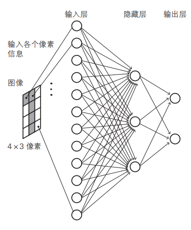
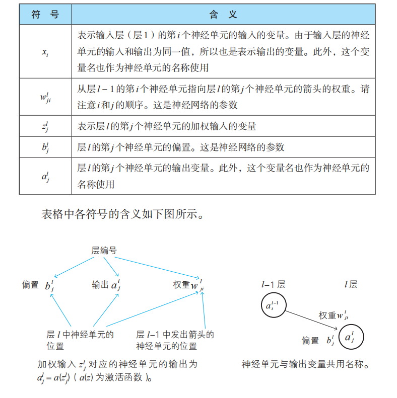
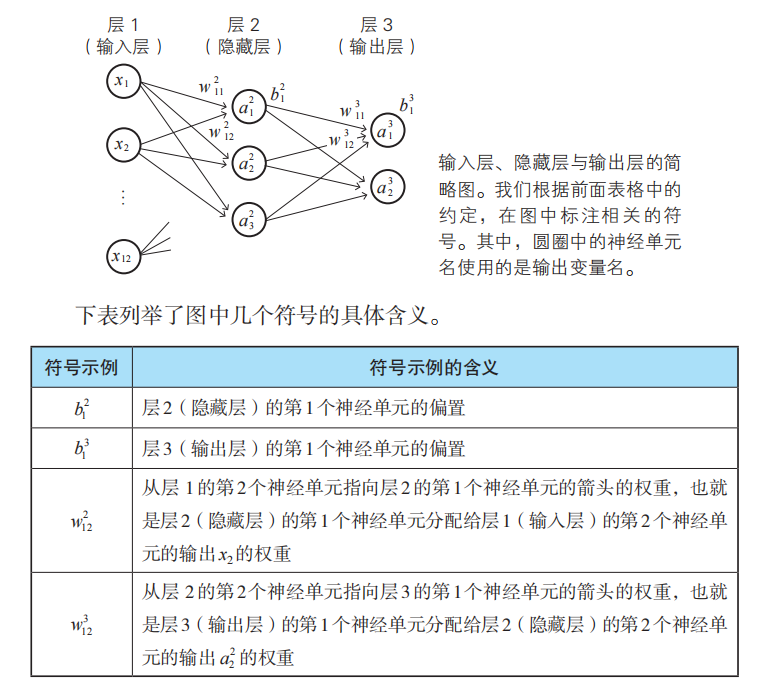
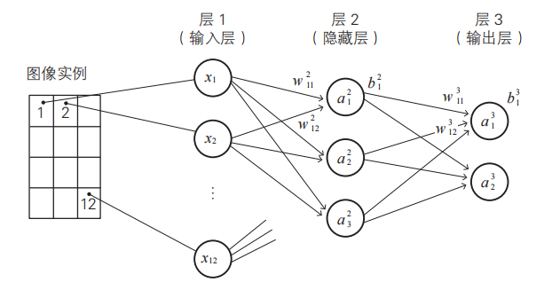
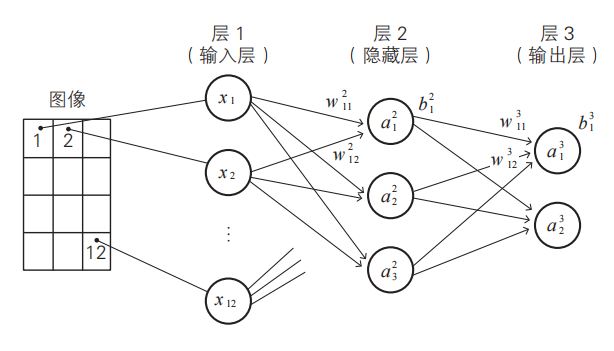

## 神经网络基础

### 参数和变量

#### 参数和变量

权重和偏置这种确定数学模型的常数称为模型的参数

输入的数据，加权输入的数据，神经单元输出的数据是变量

神经网络中用到的参数和变量数量庞大：构成神经网络的神经单元的数量非常大，相应地表示偏置、权重、输入、输出的变量的数目也变得非常庞大。

#### 神经网络中用到的变量名和参数名（建议规范）

#### 输入层相关的变量名

$(x_1,x_2,\cdots,x_n)$

#### 隐藏层、输出层相关的参数名与变量名

### 神经网络的变量的关系式

要确定神经网络，就必须在数学上确定其权重和偏置，为此需要用具体的式子来表示神经单元的变量的关系。

#### 输入层的关系式 ：

$x_i$    表示输入层第$i$个神经单元的输入，

$a_i^1$   表示输入层，第1层第$i$个神经单元的输出

$ x_i  =  a_i^1$      输入层的输入和输出相同，

#### 隐藏层的关系式

$z_1^2$     第$2$层第$1$个神经单元的加权输入，$x_i= a_i^1$

$z_1^2=w_{11}^2x_1+w_{12}^2x_2+w_{13}^2x_3+\cdots+w_{1n}^2x_n+b_1^2$

$z_2^2=w_{21}^2x_1+w_{22}^2x_2+w_{23}^2x_3+\cdots+w_{2n}^2x_n+b_2^2$

$z_3^2=w_{31}^2x_1+w_{32}^2x_2+w_{33}^2x_3+\cdots+w_{3n}^2x_n+b_3^2$

$a_1^2$     第$2$层第$1$个神经单元的输出，$\sigma ()$ 是激活函数

$a_1^2 =\sigma (z_1^2)$  ,  $a_2^2 =\sigma(z_2^2)$  , $a_3^2 =\sigma(z_3^2)$

   

#### 输出层的关系式

举例第 $3$ 层是输出层

$z_1^3$     第 $3$ 层第 $1$ 个神经单元的加权输入，前一层的输出是当前层的输入，这里是$a_i^2$    

$z_1^3=w_{11}^3a_1^2+w_{12}^3a_2^2+w_{13}^3a_3^2+\cdots+w_{1n}^3a_n^2+b_1^3$

$z_2^3=w_{21}^3a_1^2+w_{22}^3a_2^2+w_{23}^3a_3^2+\cdots+w_{2n}^3a_n^2+b_2^3$

$a_1^3$     第3层第1个神经单元的输出，$\sigma()$ 是激活函数

$a_1^3 =\sigma (z_1^3)$  ,  $a_2^3 =\sigma(z_2^3)$  ,

#### 转换成矩阵运算

隐藏层
$$
\left\{
 \begin{matrix}
 z_{1}^2 \\
 z_2^2   \\
 z_3^2
 \end{matrix}
 \right\} =
 \left\{
  \begin{matrix}
  w_{11}^2 & w_{12}^2 & w_{13}^2 &\cdots & w_{1n}^2\\
   w_{21}^2 & w_{22}^2 & w_{23}^2 &\cdots & w_{2n}^2\\
   w_{31}^2 & w_{32}^2 & w_{33}^2 &\cdots & w_{3n}^2
  \end{matrix}
  \right\}
   \left\{
  \begin{matrix}
  x_{1}\\
   x_{2}\\
   x_{3}\\
   \vdots\\
   x_n
  \end{matrix}
  \right\}+
     \left\{
  \begin{matrix}
  b_{1}^2\\
   b_{2}^2\\
   b_{3^2}
   
  \end{matrix}
  \right\}\\
  隐藏层(3个神经单元)输出，作为下一层的输入：\\
  a_1^2 =\sigma (z_1^2)  ,  a_2^2 =\sigma(z_2^2)  , a_3^2 =\sigma(z_3^2)
$$

输出层
$$
\left\{
 \begin{matrix}
 z_1^3 \\
 z_2^3 
 \end{matrix}
 \right\} =
 \left\{
  \begin{matrix}
  w_{11}^3 & w_{12}^3 & w_{13}^3 \\
   w_{21}^3 & w_{22}^3 & w_{23}^3\\
 
  \end{matrix}
  \right\}
   \left\{
  \begin{matrix}
  a_1^2\\
   a_{2}^2\\
   a_{3}^2
  \end{matrix}
  \right\}+
     \left\{
  \begin{matrix}
  b_{1}^3\\
   b_{2}^3
  \end{matrix}
  \right\}\\
  输出层(2个神经单元)输出：\\
  a_1^3 =\sigma (z_1^3),a_2^3 =\sigma(z_2^3)
$$

### 学习数据（训练数据）与正解（实际数据）

#### 回归分析的学习数据和正解

在回归分析的情况下，如上所示，由于全部数据都整合在表格里，所以预测值和正解的关系很容易理解。

尤其在线性回归中，可以直接得到平方误差：  $\frac{1}{2}(y-\hat {y})^2$ ，这里的$y$ 是正解（实际数据），$\hat {y}$为预测值

而在神经网络的情况下，则通常无法将预测值和正解整合在一张表里。比如，判断手写数字图像是0还是1，

此例：输入层输入训练数据$k$：向量$(x_1,x_2,\cdots,x_n)$ ：  $x_i$   即 $a_i^1$   ，得到 输出层预测值 向量 $ k $   ：$ (a_1^3,a_2^3)$，

此时，定义输出变量  $a_1^3$ 接近1  代表手写数字是0，输出变量 $a_2^3$  接近1  代表手写数字是1

我们额外定义两个变量$$t1,t2$$ :

$t_1=1 \qquad t_2=0$  ,表示手写数字图像是0  

$t_1=0 \qquad t_2=1$  ,表示手写数字图像是1  

如此，我们额外的构造的正解（实际数据）

得到，平方误差$C$：$\frac{1}{2}((t_1-a_1^3)^2+(t_2-a_2^3)^2)$

一般化一下，训练数据的每一项的平方误差：$C_k = \frac{1}{2}((t_1[k]-a_1^3[k])^2+(t_2[k]-a_2^3[k])^2)$ 

### 神经网络的代价函数

向神经网络提供学习数据（训练数据），并确定符合学习数据的权重和偏置，这个过程称为**学习**

此例中，训练数据有 $k$ 个 训练数据， 就的到$k$ 个平法误差$C_k$

代价函数（损失函数）
$$
C_T= \sum_{k=1}^n C_k = \sum_{k=1}^n \frac{1}{2}((t_1[k]-a_1^3[k])^2+(t_2[k]-a_2^3[k])^2)
$$
依据神经网络的思路：通过$k$个训练数据  ,求解  本例中所有神经单元的权重和偏置（隐藏层3个神经单元，36个权重，3个偏置；输出层2个神经单元，6个权重，2个偏置，共47个参数）

为了误差最小，用$C_T$损失函数对这47个参数求偏导使其等于最小值0，并联立这47个方程求解这47个参数，不可能完成的任务。

再次理解梯度下降
$$
(\Delta x_1,\Delta x_2,\cdots,\Delta x_n)=- \eta (\frac{\partial f(x_1,x_2,\cdots,x_n)}{\partial x_1},\frac{\partial f(x_1,x_2,\cdots,x_n)}{\partial x_2},\cdots,\frac{\partial f(x_1,x_2,\cdots,x_n)}{\partial x_n})\\
简写下：\\

(\Delta x_1,\Delta x_2,\cdots,\Delta x_n)=- \eta (\frac{\partial f}{\partial x_1},\frac{\partial f}{\partial x_2},\cdots,\frac{\partial f}{\partial x_n})\\
$$

现在的情况是，$f$ 变成了 $C_T$   ,变复杂了，

位移向量是$47$个参数组成的 ：$(\Delta w_{11}^2,\cdots,\Delta w_{11}^3, \cdots,\Delta b_1^2,\cdots,\Delta b_1^3,\cdots)$ 

梯度是损失函数（代价函数）对47个参数的偏导组成的向量：$(\frac{\partial C_T}{\partial w_{11}^2},\cdots,\frac{\partial C_T}{\partial w_{11}^3},\cdots,\frac{\partial C_T}{\partial b_{1}^2},\cdots,\frac{\partial C_T}{\partial b_{1}^3},\cdots)$

学习率是： $- \eta $		（微小的正常数）

改写上式：
$$
(\Delta w_{11}^2,\cdots,\Delta w_{11}^3, \cdots,\Delta b_1^2,\cdots,\Delta b_1^3,\cdots) =- \eta (\frac{\partial C_T}{\partial w_{11}^2},\cdots,\frac{\partial C_T}{\partial w_{11}^3},\cdots,\frac{\partial C_T}{\partial b_{1}^2},\cdots,\frac{\partial C_T}{\partial b_{1}^3},\cdots)
$$

### 在神经网络中的梯度下降法

#### 以前的梯度下降思路：

步骤1：用神经单元当前的权重和偏置（47个）加上 上式求得的位移向量$(\Delta w_{11}^2,\cdots,\Delta w_{11}^3, \cdots,\Delta b_1^2,\cdots,\Delta b_1^3,\cdots)$ 

步骤2：将得到的新的权重和偏置再带入上式求得心得位移向量，重复步骤1，最终的到使得损失函数$C_T$最小的  权重和偏置

但是，实际计算非常的困难，因为这里的损失函数是和神经网络层数和神经单元数量相关的超级复合函数，所以梯度中每一个分量的偏导求解，利用链式法则的，超级复杂！！超级困难！！ 陷入**导数地狱**！！！

也就是说梯度下降法中，梯度的计算，需要改进！

#### 改进思路后的梯度计算：先求导，再求和

步骤1：若要求梯度分量$\frac{\partial C_T}{\partial w_{11}^2}$     ，使用第1个训练数据，利用平方误差公式 $C_1$：$\frac{1}{2}((t_1-a_1^3)^2+(t_2-a_2^3)^2)$  求得偏导$  \frac{\partial C_1}{\partial w_{11}^2}$  ，

步骤2：然后依次使用后续$k$个训练数据，求得$ \frac{\partial C_k}{\partial w_{11}^2}$     ，

步骤3：累加$ \frac{\partial C_k}{\partial w_{11}^2}$    ，即可得到梯度分量中的$\frac{\partial C_T}{\partial w_{11}^2}$      

步骤4： 梯度中其他分量，同理可求。

### 神经单元误差

梯度下降法对于寻找多变量函数的最小值的问题是有效的。然而在神经网络的世界中，变量、参数和函数错综复杂，无法直接使用梯度下降法，于是就出现了误差反向传播法。作为应用这个方法的准备工作，引入一个名为神经单元误差的变量。

误差反向传播法的特点是将繁杂的导数计算替换为数列的递推关系式，而提供这些递推关系式的就是名为**神经单元误差（error）**的变量   $\delta _j^l$
$$
\delta _j^l  =  \frac{\partial C}{ \partial z_j^l}   \\
这里的：\\
l=(2,3,\cdots)  层数\\
z_j^l  ：第l层第j个神经单元的加权输入
$$
引入$\delta _j^l$  的目的是为了变形，变形，变形

可证明：   在梯度下降算法中，求解，每个训练数据的平方误差相对于某个参数的偏导时  如$\frac{\partial C_k}{\partial w_{11}^2}$    可得
$$
\frac{\partial C_k}{\partial w_{11}^2}  =\delta _1^2  a_1^1\\
这里：
a_1^1 就是x_1,   \delta _1^2  就是第2层第1个神经单元的单元误差\\
当然 w_{11}^2  是第2层，第一个神经单元，相对于训练数据向量中第1个数据\\
提示：输入层的神经单元输入和输出相同
$$
可证明：   在梯度下降算法中，求解，每个训练数据的平方误差相对于某个参数的偏导时  如$\frac{\partial C_k}{\partial w_{11}^3}$    可得

$$
\frac{\partial C_k}{\partial w_{11}^3}  =\delta _1^3  a_1^2\\
这里：
a_1^1 就是x_1,   \delta _1^2  就是第2层第1个神经单元的单元误差\\
当然 w_{11}^2  是第2层，第一个神经单元，相对于训练数据向量中第1个数据\\
提示：输入层的神经单元输入和输出相同
$$

**一般化一个重要的公式：**
$$
\frac{\partial C_k}{\partial w_{ji}^l}  =\delta _j^l  a_i^{l-1}\\
\frac{\partial C_k}{\partial b_{j}^l}  =\delta _j^l  \\
$$
还是截个图放这里看下：

练习下：

利用链式法则，请用  $\delta _1^2 $  来表示  :  $\frac{\partial C_k}{\partial w_{12}^2}$   、$\frac{\partial C_k}{\partial w_{23}^3}$     和  $\frac{\partial C_k}{\partial b_{2}^3}$
$$
\frac{\partial C_k}{\partial w_{12}^2} =  \frac{\partial C_k}{\partial z_{1}^2} \frac{\partial z_1^2}{\partial w_{12}^2}  = \delta _1^2 a_2^1  = \delta _1^2 x_2       \\
注意，第1层是输入层，第1层第2个神经单元的输出数据 就是x_2 \\

\frac{\partial C_k}{\partial w_{23}^3}  = \frac{\partial C_k}{\partial z_{2}^3} \frac{\partial z_2^3}{\partial w_{23}^3} = \delta _2^3 a_3^2 \\
解读下： 平方误差C_k对于第3层第2个神经单元第3个输入权重的偏导，等于 该神经单元的神经单元误差\delta _2^3  和  对向神经单元输出a_3^2 的积 \\

\frac{\partial C_k}{\partial b_{2}^3} = \frac{\partial C_k}{\partial z_{2}^3} \frac{\partial z_2^3}{\partial b_2^3} = \delta _2^3  \\
解读下： 平方误差C_k对于第3层第2个神经单元的偏置的偏导，等于该神经单元误差\delta _2^3  \\
$$

有了这个神奇的神经单元误差 $\delta $  ，我们就可以很方便的求解   $C_k$  关于  神经网络中每个神经单元的对应权重和偏置的偏导

有了神经网络中$C_k$ 关于每个神经单元的对应权重和偏置的偏导，我们就可以累加出  $C_T$  关于每个神经单元的对应权重和偏置的偏导 ， 即 每一个梯度分量

有了每一个梯度分量，就有了梯度

有了梯度就可以计算出位移向量

也就是打通了梯度下降法任督两脉~~~，可以找到令$C_T$最小时的所有权重和偏置，即模型的所有参数！

**那么关键来了，如何计算出神经单元误差**

### 误差反向传播法 （  求神经单元误差  $\delta$   ）

思考：考虑一下将  $\delta _j^l  =  \frac{\partial C}{ \partial z_j^l}  $    称为神经单元误差的含义。

从这个定义可知，$\delta _j^l $   表示神经单元的加权输入 $z_j^l$     给平方误差带成的变化率。

如果神经网络符合数据（拟合），根据最小值条件，变化率应该为 0。

换言之，如果神经网络符合数据（拟合），神经单元误差  $\delta _j^l $  也为 0。  

那就是说，可以认为    $\delta _j^l $   表示与符合数据（拟合）的理想状态的偏差。这个偏差表示为“误差”。

**误差反向传播法（$BP$ 法）**：具体来说，就是建立 引入的神经单元误差   $\delta _j^l $   的递推关系式，通过这些递推关系式来回避复杂的导数计算

#### 计算输出层的 $\delta$  

##### $\delta$  的定义：

$$
\delta _j^l  =  \frac{\partial C}{ \partial z_j^l}   \\
这里的：\\
l=(2,3,\cdots)  层数\\
z_j^l  ：第l层第j个神经单元的加权输入
$$

若神经网络的层数为3，第3层就是输出层，激活函数是 $\sigma ()$

根据链式法则：
$$
a_1^3 =\sigma (z_1^3),a_2^3 =\sigma(z_2^3) \\
  神经单元的加权输入代入激活函数后的输出，即为该神经单元的输出 \\
  
\delta _j^3  =\frac{\partial C}{ \partial z_j^3} = \frac{\partial C}{ \partial a_j^3} \frac{\partial a_j^3} { \partial z_j^3} = \frac{\partial C}{ \partial a_j^3} a'(z_j^3)\\
$$
如此，如果给出了激活函数 就可以求出   $\delta _j^3 $  ，换句话说，就是求出了，数列序列的**末项**

**一般化公式**：

$$
\delta _j^L  =\frac{\partial C}{ \partial z_j^L} = \frac{\partial C}{ \partial a_j^L} a'(z_j^L)\\
$$

**练习一下：**  若激活函数是Sigmoid函数 $\sigma ()$，计算    $\delta _1^3  $

解：  

已知：  平方误差$C$：$\frac{1}{2}((t_1-a_1^3)^2+(t_2-a_2^3)^2)$

有 ：$\frac{\partial C}{ \partial a_1^3} = a_1^3 - t_1$

有：$\delta _j^3  = (a_1^3 - t_1) a'(z_1^3)$

已知：$a_1^3 =\sigma (z_1^3)$  且  $\sigma '(x)=\sigma (x)(1-\sigma (x)) $

得到：$ a_1^3 =\sigma '(z_1^3)=(a_1^3 - t_1) \sigma(z_1^3)(1-\sigma(z_1^3)) $

#### 隐藏层（中间层）  $\delta $ 的“反向”递推关系式

计算下 $\delta _1^2$  : 

已知，$\delta $  定义的一般化公式，复合函数偏导的链式法则：

有：$\delta _1^2  =\frac{\partial C}{ \partial z_1^2} = \frac{\partial C}{ \partial z_1^3}\frac{\partial z_1^3}{ \partial a_1^2}\frac{\partial a_1^2}{ \partial z_1^2} + \frac{\partial C}{ \partial z_2^3}\frac{\partial z_2^3}{ \partial a_1^2}\frac{\partial a_1^2}{ \partial z_1^2}$

整理得：

$\delta _1^2  = (\delta _1^3 w_{11}^3 + \delta _2^3 w_{21}^3) a'(z_1^2)$

解读下： 第2层第1个神经单元的神经单元误差 等于（ 第3层第1个单元的权重和误差的乘积 + 第3层第2个单元的权重和误差的乘积 ）乘  $ a'(z_1^2)$

放张图看清楚：

**一般化递推公式**（从末项开始，向前面递推）：
$$
\delta _i^L =(\delta _1^{L+1}w_{1i}^{L+1}+\delta _2^{L+1}w_{2i}^{L+1}+\cdots +\delta _m^{L+1} w_{mi}^{L+1})a'(z_i^L)  \\

m：是第L+1层的神经单元的个数,且 L\ge2
$$
如此这般，只需要求出输出层的神经单元误差，其他的神经单元误差 可以利用此递推公式计算得出，**无需再进行偏导计算**

#### 表示模型准确度的代价函数

#### 最优化的基础：代价函数的最小化

#### 神经网络的代价函数

#### 参数的个数和数据的规模

#### 神经网络和回归分析的差异

神经网络需要更强大的数学武器，其中代表性的一种方法就是误差反向传播法。

梯度下降法的回顾

有
