卷积

任务：建立一个卷积神经网络，用来识别通过 6×6 像素的图像读取的手写数字 1、2、3。图像的像素为单色二值。

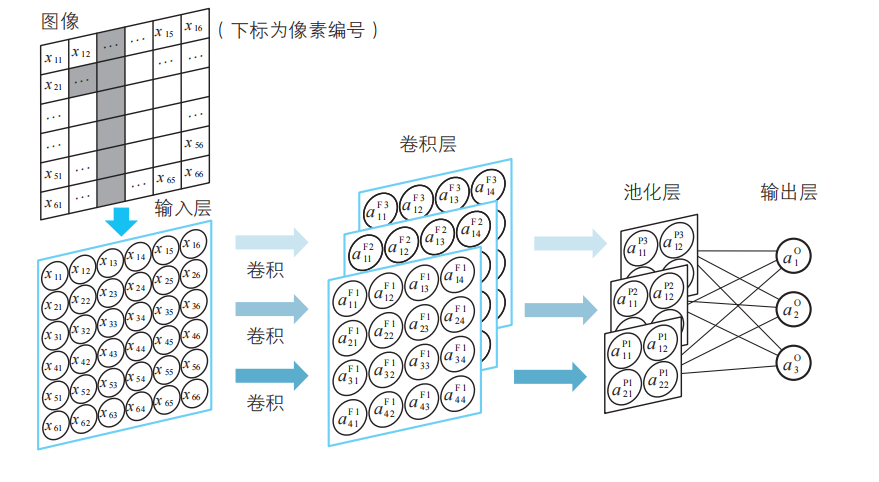

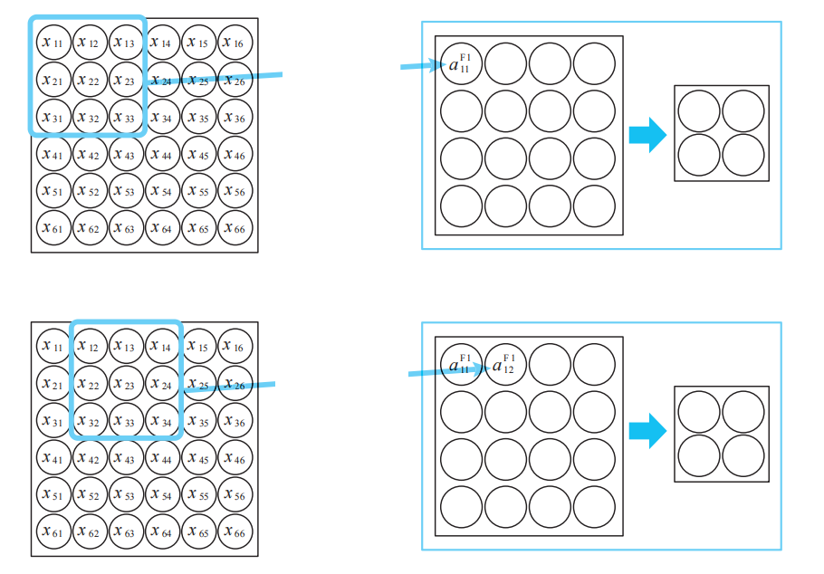

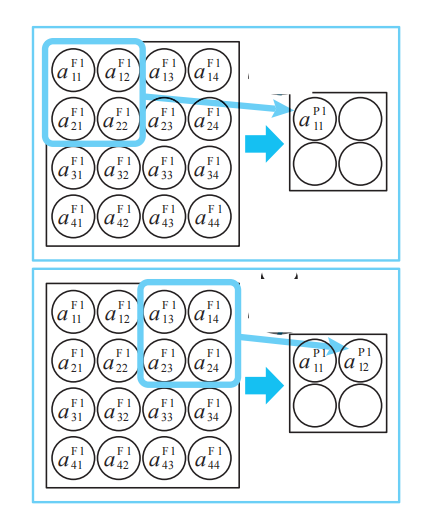

三个卷积层（Filter）和池化层（Pool）组成的隐藏子层。

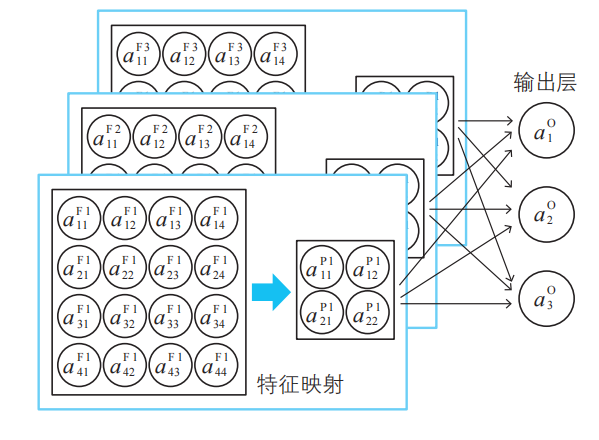

卷积层会积极地扫描图像，整理偏好特征并输出。卷积神经网络具有简单神经网络所没有的优点

① 对于复杂的模式识别问题，也可以用简洁的网络来处理。

② 整体而言，因为神经单元的数量少了，所以计算比较轻松。

#### 卷积思路：

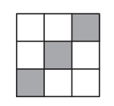

过滤器S

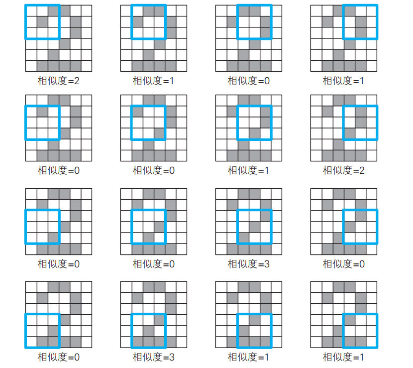

对图像进行扫描，得到相似度

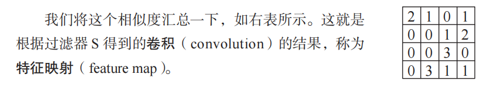

卷积层中的神经单元将这一卷积的结果作为输入信息。各神经单元将对应的卷积的值加上特征映射固有的偏置作为加权输入，如图：

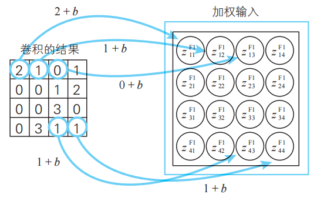

卷积层的各个神经单元通过激活函数来处理加权输入，并将处理结果作为神经单元的输出。这样卷积层的处理就完成了

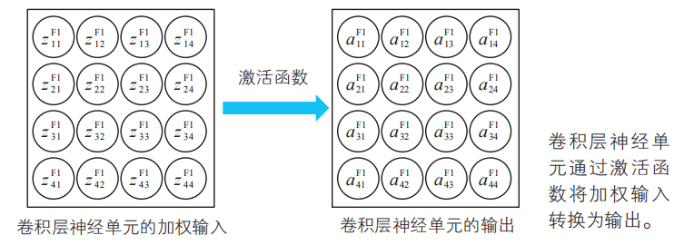

#### 池化思路：

只需要将卷积层神经单元划分为不重叠的n×n 的区域，然后在各个区域中计算出代表值即可。我们使用最有名的信息压缩方法最大池化（max pooling），具体来说就是将划分好的各区域的最大值提取出来。如图：

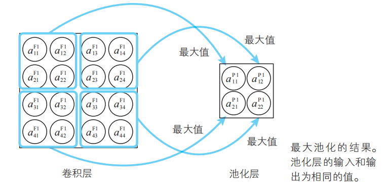

#### 卷积神经网络的变量关系式

##### 规划各层的含义以及变量名、参数名

变量一览

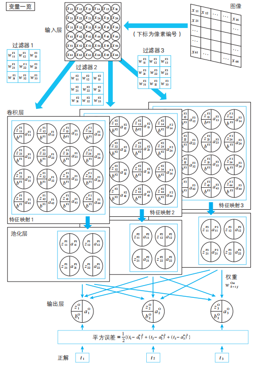

变量说明：

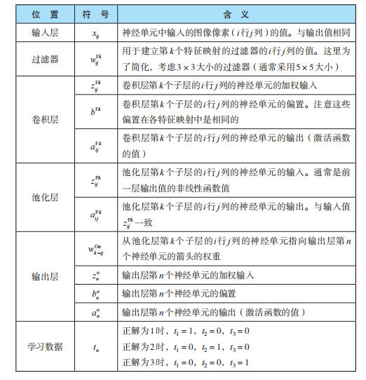

##### 输入层（输入层的输入值和输出值相同）

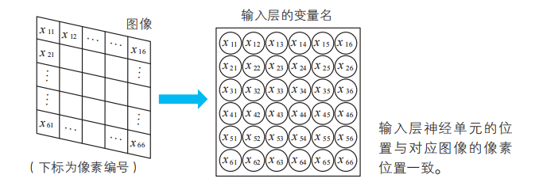

##### 过滤器和卷积层

过滤器也是模型的参数，也是通过对训练数据（学习数据）学习而确定的结果。理论上也可以理解为权重$w$

过滤器也称为核（卷积核），大小通常为$5 \times 5$  ,数目：视情况~~？

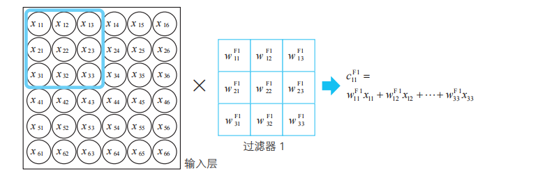

卷积：
$$
c_{11}^{F1}=w_{11}^{F1}x_{11}+w_{12}^{F1}x_{12}+\cdots+w_{33}^{F1}x_{33}\\

构成的卷积层，描述相似度
$$
对于多个过滤器，一般化卷积层每个子层的每个神经单元的加权输入（$z_{ij}^{Fk}$）的公式：
$$
z_{ij}^{Fk}=w_{11}^{Fk}x_{ij}+w_{12}^{Fk}x_{i{(j+1)}}+\cdots+w_{33}^{Fk}x_{(i+2)(j+2)} +b^{Fk} \\

一般情况，对于卷积层，每个子层有共同的偏置 b
$$
对于卷积层的每个子层的每个神经单元的输出（$a_{ij}^{Fk}$）公式：
$$
a_{ij}^{Fk}= \alpha (z_{ij}^{Fk})  \\
$$
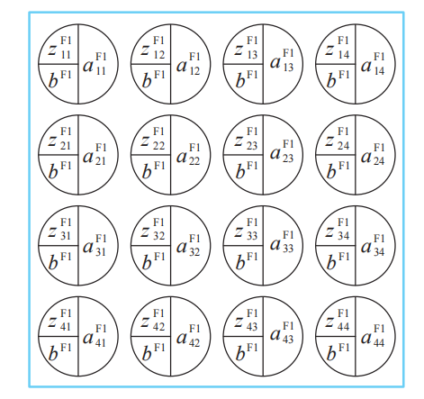

##### 池化层：用于压缩卷积层信息

压缩的方法有很多种，比如较为有名的最大池化法

池化层的神经单元不存在权重和偏置的概念，也就是不具有模型参数

由于输入和输出是相同的值，所以也不存在激活函数的概念（或者说激活函数是恒等函数）

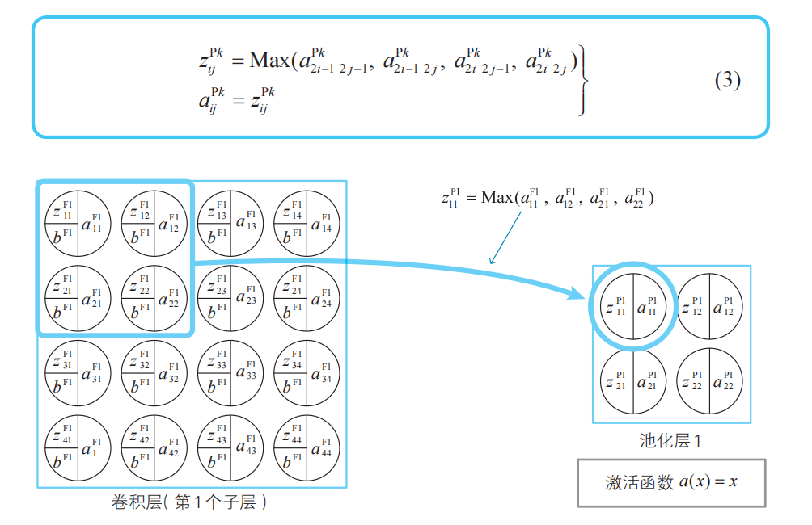

##### 输出层

接收来自池化层的所有神经单元的箭头（即全连接）。这样就可以综合地考察池化层的神经单元的

信息：

输出层第$n$个神经单元的加权输入公式：
$$
z_{n}^{O}= w_{1-11}^{On}a_{11}^{P1}+w_{1-12}^{On}a_{12}^{P1}+\cdots+w_{2-11}^{On}a_{11}^{P2}+w_{2-12}^{On}a_{12}^{P2}+\cdots + w_{3-11}^{On}a_{11}^{P3}+w_{3-12}^{On}a_{12}^{P3}+\cdots + b_n^O 
$$

输出层第$n$个神经单元的输出公式
$$
a_n^O= \alpha (z_n^O)
$$
如图：

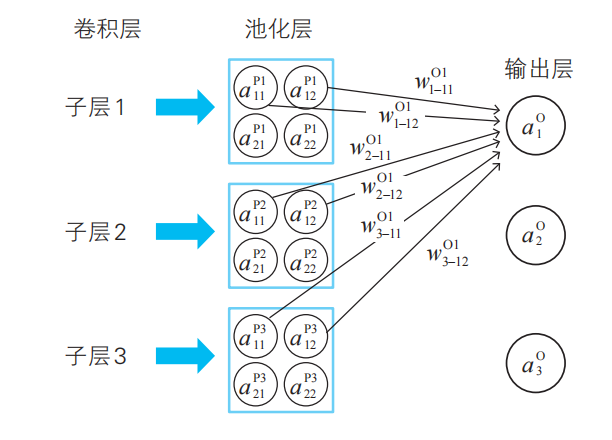

代价函数（损失函数）公式 ：
$$
C=\frac{1}{2}((t_1-a_1^O)^2+(t_2-a_2^O)^2+(t_3-a_3^O)^2) \\

C_k=\frac{1}{2}((t_1[]k-a_1^O[k])^2+(t_2[k]-a_2^O[k])^2+(t_3[k]-a_3^O[k])^2)  \\

t 表示训练数据的正解 \\
k 表示第k训练数据\\
有，大家函数C_T\\

C_T=C_1+C_2+\cdots+C_T
$$
