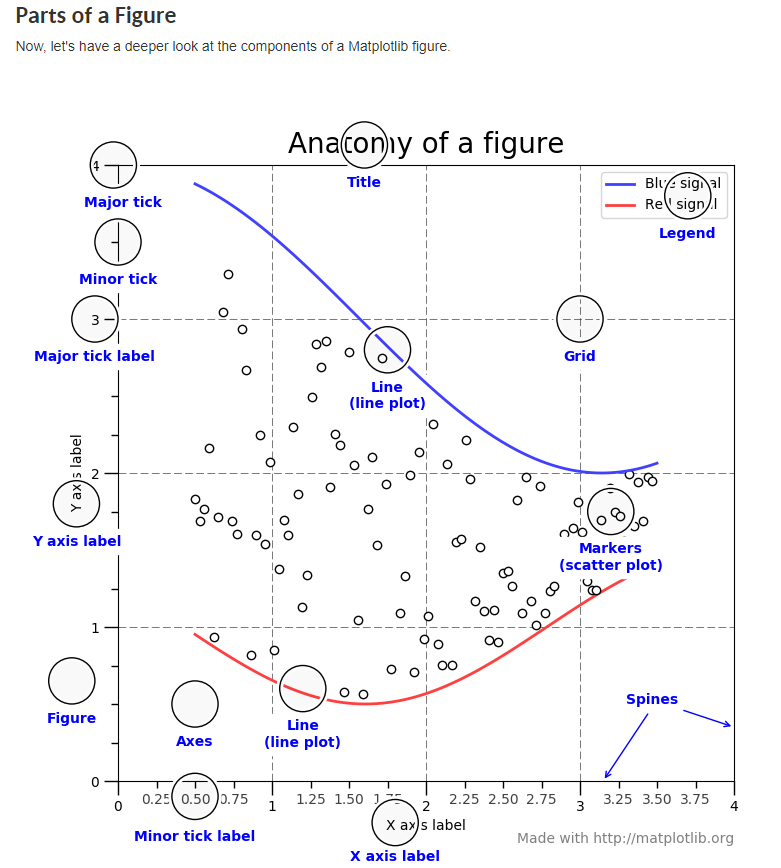
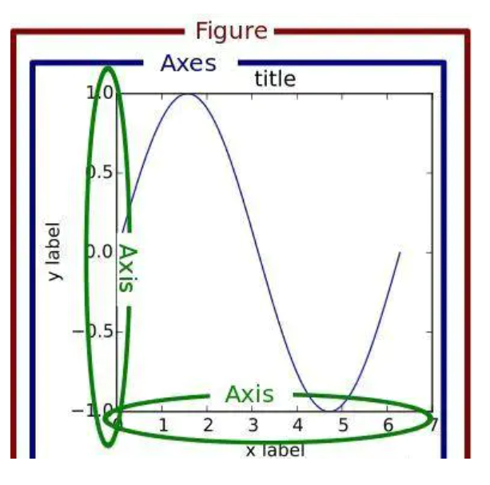
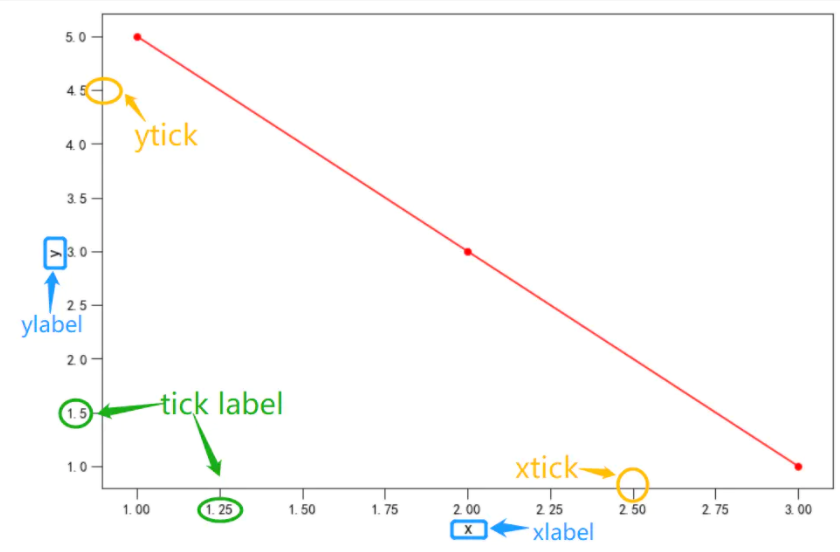

### 课前准备

[Anaconda安装与虚拟环境搭建]: https://juejin.cn/post/6895561802164207629

```bash
#切换环境
#Windows :
activate   XXXX
#Mac: 
source activate XXXX

pip install Matplotlib
```

### 课堂主题

- Matplotlib;
- 


### 知识要点

#### 1、Matplotlib介绍




```python
import matplotlib.pyplot as plt
%matplotlib inline
plt.plot([1,0,9],[4,5,6])
plt.show()
```


```python
#coding:utf-8
import matplotlib.pyplot as plt
import random

plt.rcParams['font.sans-serif'] = ['SimHei']
# SimHei：微软雅黑
# FangSong：仿宋
# 常用的，其他的可以上网搜一搜

plt.rcParams['font.sans-serif']=['SimHei'] #用来正常显示中文标签
plt.rcParams['axes.unicode_minus']=False #用来正常显示负号
#有中文出现的情况，需要u'内容'

fig,ax = plt.subplots()
ax.plot(['北京','上海','深圳'],[1,3,5])
plt.show()

```

#### 关于plt和ax




```python
plt.figure()
plt.plot([1,2,3],[4,5,6])
plt.show()

# 第二种方式
fig,ax = plt.subplots()
ax.plot([1,2,3],[4,5,6])
plt.show()
```

从第一种方式的代码来看，先生成了一个`Figure`画布，然后在这个**画布上隐式生成一个画图区域进行画图**。

第二种方式同时生成了`Figure`和`axes`两个对象，然后用`ax`对象在**其区域内**进行绘图

如果从**面向对象编程**（对理解`Matplotlib`绘图很重要）的角度来看，显然第二种方式更加易于解释，生成的`fig`和`ax`分别对画布`Figure`和绘图区域`Axes`进行控制，第一种方式反而显得不是很直观，如果涉及到子图**零部件的设置**，用第一种绘图方式会很难受。

在实际绘图时，也更**推荐使用第二种方式。**

#### subplot的绘制

```python
# 生成画布和axes对象
# nrows=1和ncols=2分别代表1行和两列
fig,ax = plt.subplots(nrows=1,ncols=2)

print(fig)
print(ax)

ax[0].plot([1,2,3],[4,5,6])
ax[1].scatter([1,2,3],[4,5,6])

```


#### 折线图

##### 1、折线图的绘制

```python
from matplotlib import pyplot as plt
x=range(1,8)
y=[17,17,18,15,11,11,13]
plt.plot(x,y)
plt.show()
```


##### 2、折线的颜色和形状样式的设置

```python
from matplotlib import pyplot as plt
x=range(1,8)
y=[17,17,18,15,11,11,13]
plt.plot(x,y,color='red',alpha=0.5,linestyle='--',linewidth=3)
plt.show()
'''
linestyle=''线的样式
- 实线(solid)
--短线(dashed)
-.短点相间(dashdot)
: 虚点线(dotted)
marker='' 折点的样式
.   point marker
,   pixel marker
o   circle marker
v   triangle_down marker
^   triangle_up marker
<或 > triangle_left或right marker
1/2/3/4 tri_down/up/left/right marker
s square marker
p pentagon marker
* star marker
h hexagon1 marker
H hexagon2 marker
+  plus marker
x  x marker
D  diamond marker
d  thin_diamond marker
|   vline 
_   hline


'''
```


##### 3、图片（画布）的大小

```python
from matplotlib import pyplot as plt
import random
x= range(2,26,2)
y=[random.randint(15,30) for i in x]
plt.figure(figsize=(10,4),dpi=80)
plt.plot(x,y)
plt.show()
```


##### 4、绘制X轴和Y轴的刻度

```python
from matplotlib import pyplot as plt
import random
x= range(2,26,2)
y=[random.randint(15,30) for i in x]
plt.figure(figsize=(10,4),dpi=80)
x_ticks_label = ['{}:00'.format(i) for i in x]
y_ticks_label = ['{}℃'.format(i) for i in range(min(y),max(y)+1)]
plt.xticks(x,x_ticks_label,rotation=45)
plt.yticks(range(min(y),max(y)+1),y_ticks_label,rotation=45)
plt.plot(x,y)
plt.show()
```


##### 5、设置中文

```python
#coding:utf-8
import matplotlib.pyplot as plt
import random
plt.rcParams['font.sans-serif']=['SimHei'] #用来正常显示中文标签
plt.rcParams['axes.unicode_minus']=False #用来正常显示负号
#有中文出现的情况，需要u'内容'
x = range(0,120)
y = [random.randint(10,30) for i in range(120)]
plt.figure(figsize=(10,4),dpi=80)
plt.xlabel=(u'时间')
plt.ylabel=(u'次数',rotation=90)
plt.title(u'每分钟跳动次数',color='red')
plt.plot(x,y)
plt.show()


```


##### 边框的显示

函数：`ax.spines[loc].set_visible(False)`

一般的图表中，`Matplotlib`会默认显示出图形的`spine`，英文其实不太好翻译，谷歌翻译成脊柱

```python
fig,ax = plt.subplots()
ax.plot(['北京','上海','深圳'],[1,3,5])
# 只要左边和底部的边框
ax.spines['right'].set_visible(False)
ax.spines['top'].set_visible(False)
plt.show()
```


##### 图例的设置（legend）

函数：`ax.legend()`

图例是对图形所展示的内容的解释，比如在一张图中画了三条线，那么这三条线都代表了什么呢？这时就需要做点注释。

```python
# 第一种：
# plot的时候加上label,之后调用ax.legend()
fig,ax = plt.subplots()
ax.plot(['北京','上海','深圳'],[1,3,5],label='2010')
ax.plot(['北京','上海','深圳'],[2,4,6],label='2020')
ax.legend()
plt.show()

# 第二种：
# 使用ax.legend()按顺序设置好图例
fig,ax = plt.subplots()
ax.plot(['北京','上海','深圳'],[1,3,5])
ax.plot(['北京','上海','深圳'],[2,4,6])
ax.legend(['2010','2020'])
plt.show()

```


##### 设置双坐标轴

函数：`ax.twinx()`

双坐标轴一般用于**复合图表**，同时表示两种图表的指标**量纲不一**，经典的使用场景如帕累托图。

使用中，需要对原有的`ax`使用`.twinx()`方法生成`ax2`，再利用`ax2`进行绘图

```python
fig,ax = plt.subplots()
ax.plot(['北京','上海','深圳'],[1,3,5],color='r')

# 双坐标用法
ax2 = ax.twinx()
ax2.bar(['北京','上海','深圳'],[20,40,60],alpha=0.3)

plt.show()

```


##### 坐标轴相关

在一张二维图中，关于坐标轴各个零件的术语如图所示



首先有横坐标`xaxis`和纵坐标`yaxis`（注意与`axes`区分），横纵坐标上的标签（也可以说是横纵坐标的名字）为`xlabel`和`ylabel`，横纵坐标上有刻度线`tick`，刻度上对应的刻度标签则是`tick label`。

具体设置时所对应的函数为

- xlabel --> `ax.set_xlabel()`
- ylabel --> `ax.set_ylabel()`
- tick和tick label --> `ax.tick_params`，`ax.xticks()`，`ax.yticks()`


```python
fig,ax = plt.subplots()
ax.scatter([3,2,1],[1,3,5],color='r')
ax.plot([3,2,1],[1,3,5],color='r')

# 分别设置xy轴的标签
ax.set_xlabel('X轴',fontsize=12)
ax.set_ylabel('Y轴',fontsize=12)

```


```python
fig,ax = plt.subplots()
ax.scatter([3,2,1],[1,3,5],color='r')
ax.plot([3,2,1],[1,3,5],color='r')

# fontsize设置刻度标签的大小
# direction控制刻度是朝内还是朝外显示
ax.tick_params(labelsize=14,direction='in')


```

##### 设置坐标轴范围

```python
import matplotlib.pyplot as plt
import numpy as np

x= np.arange(-10,11,1)
y=x**2
plt.plot(x,y)
plt.xlim([-5,5])
plt.show()
```


##### 网格线（grid）的设置

函数：`ax.grid()`

网格线多用于辅助查看具体的数值大小，横纵坐标都可以设置相应的网格线，视具体情况而论。

```python
fig,ax = plt.subplots()
ax.plot([1,2,3],[4,2,6],color='r')
# b参数设置是否显示网格
# axis参数设置在哪个轴上显示网格线，可选参数为'x','y','both'
ax.grid(b=True,axis='y')

```

