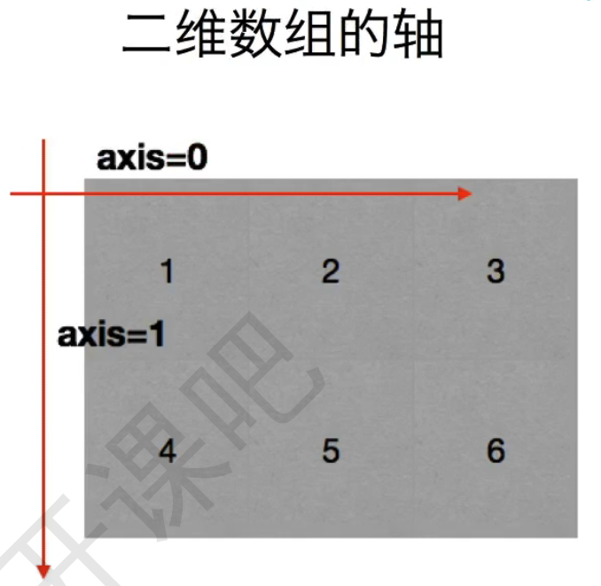
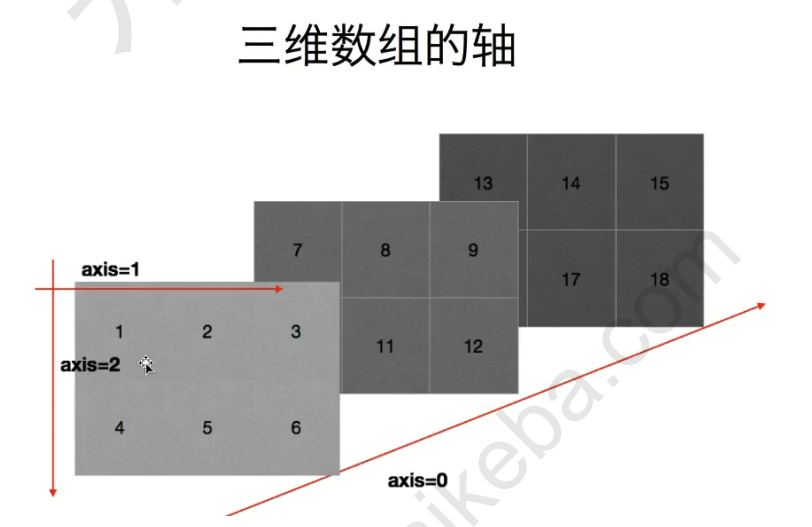
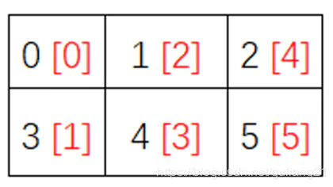

### 课前准备

[Anaconda安装与虚拟环境搭建]: https://juejin.cn/post/6895561802164207629

```bash
#切换环境
#Windows :
activate   XXXX
#Mac: 
source activate XXXX

pip install numpy
```

### 课堂主题

- NumPy在运算速度上的优势;
- Numpy中数组：Ndarray 对象的属性、形状、类型；
- 掌握数组的基本操作，数组之间的运算

- 数组的合并（连接）、分割nan和inf处理


### 知识要点

#### 1、NumPy  介绍


[NumPy中文官网]: https://www.numpy.org.cn/

- NumPy（Numerical Python)是使用Python进行**科学计算**的基础软件包
- Numpy 是 *Python* 中科学计算的核心库，*NumPy* 这个词来源于 *Numerical* 和 *Python* 两个单词。它提供了一个高性能的多维数组对象，以及大量的库函数和操作，可以帮助程序员轻松地进行数值计算，广泛应用于机器学习模型、图像处理和计算机图形学、数学任务等领域。

#### 2、为什么要学NumPy

- NumPy支持常见的数组和矩阵操作。对于同样的数值计算任务，使用NumPy比直接使用Python要简洁得多；
- NumPy中的数组的存储效率和输入输出性能均远远优于Python中等价的基本数据结构（列表），且其能够提升的性能是与元素多少成比例的；
- NumPy的大部分代码都是用C语言写的，其底层算法在设计时就有着优异的性能，这使得NumPy比纯Python代码高效得多；
- 示例：NumPy的ndarray对象与Python原生的list对比：

```python
import random
import time
import numpy as np

a=[]
for i in range(100000000):
    a.append(random.random())
t1=time.time()
sum1=sum(a)
t2=time.time()

b=np.array(a)
t3=time.time()
sum2=np.sum(b)
t4=time.time()
print(sum1,sum2)
#运行时间
print(t2-t1,t4-t3)

## 49999040.36357743 49999040.363582045
##0.6257514953613281 0.13160014152526855
```


#### 3、Numpy 数组：ndarray

*NumPy* 中定义的最重要的对象是称为 *ndarray* 的 *N* 维数组类型，它是描述**相同类型**的元素集合。*ndarray* 中的每个元素都是数据类型对象(dtype)的对象。*ndarray* 中的每个元素在内存中使用相同大小的块。

```python
import numpy as np
arr1= np.array(object, dtype=None, copy=True, order='K', subok=False, ndmin=0)

```


| 参数   | 描述                                                         |
| ------ | ------------------------------------------------------------ |
| object | 任何暴露数组接口方法的对象(常量，list，矩阵……等 )            |
| dtype  | 数据类型（附表）                                             |
| copy   | 如果为 True，则 object 对象被复制，否则，只有当`__array__`返回副本，object 是嵌套序列，或者需要副本来满足任何其他要求（dtype，order等）时，才会生成副本。 |
| order  | 指定阵列的内存布局。 如果 object 不是数组，则新创建的数组将按行排列（C），如果指定了（F），则按列排列。 如果 object 是一个数组，则以下成立。C（按行）、F（按列）、A（原顺序）、K（元素在内存中的出现顺序） |
| subok  | 默认情况下，返回的数组被强制为基类数组。 如果为 True，则返回子类。 |
| ndmin  | 返回数组的最小维数                                           |

##### **例一：最简单的示例**

```python
import numpy as np

a = [1, 2, 3]
arr1 = np.array(a)
print(a)
print(arr1)
print(type(arr1))

'''
[1, 2, 3]
[1 2 3]
<class 'numpy.ndarray'>
注意：list 打印显示是 `[1, 2, 3]`，而 ndarray 打印显示是 `[1 2 3]`，当中没有逗号。
'''

```


##### **例二：dtype 参数用法示例** :*NumPy* 支持比 *Python* 更多种类的数值类型

```python
import numpy as np

a = [1, 2, 3]
b = np.array(a, dtype=np.float_)
# 或者
b = np.array(a, dtype=float)

print(b)
print(type(b))
print(b.dtype)
print(type(b[0]))

'''
[1. 2. 3.]
<class 'numpy.ndarray'>
float64
<class 'numpy.float64'>
'''
```

##### **例三：copy 参数的用法**

```python
import numpy as np

a = np.array([1, 2, 3])
b = np.array(a, copy=True)  #默认 深拷贝
c = np.array(a, copy=False) #浅拷贝 
d = np.array(a) #默认深拷贝 
a[0] = 0

print("a",a)
print("b",b)
print("c",c)
print("d",d)
'''
a [0 2 3]
b [1 2 3]
c [0 2 3]
d [1 2 3]
'''
```

##### **例四：ndmin 参数用法示例**

```python
import numpy as np

a = [1, 2, 3]
b = np.array(a, ndmin=2)
#设置返回数组的最小维数
print(b)
'''
[[1 2 3]]
可以看到结果已经变成了二维数组。
'''
```

##### **例五：subok 参数用法示例**

其中 `matrix` 是矩阵。

```python
import numpy as np

a = np.matrix('1 2 7; 3 4 8; 5 6 9')
print(type(a))
print(a)
at = np.array(a, subok=True)
af = np.array(a, subok=False)
print(type(at))
print(type(af))
'''
<class 'numpy.matrix'>
[[1 2 7]
 [3 4 8]
 [5 6 9]]
<class 'numpy.matrix'>
<class 'numpy.ndarray'>
'''
```


#### 4、NumPy 数组属性

*NumPy* 数组的维度（又称维数）称为秩（*rank*），一维数组的秩为 1，二维数组的秩为 2，以此类推。 *NumPy* 中，每一个线性的数组称为是一个轴（*axis*），也就是维度（*dimensions*）。

| 属性             | 说明                                                         |
| ---------------- | ------------------------------------------------------------ |
| ndarray.ndim     | 秩，即轴的数量或维度的数量                                   |
| ndarray.shape    | 数组的维度，对于矩阵，n 行 m 列                              |
| ndarray.size     | 数组元素的总个数，相当于 .shape 中 n*m 的值                  |
| ndarray.dtype    | ndarray 对象的元素类型                                       |
| ndarray.itemsize | ndarray 对象中每个元素的大小，以字节为单位                   |
| ndarray.flags    | ndarray 对象的内存信息                                       |
| ndarray.real     | ndarray 元素的实部（复数的实部）                             |
| ndarray.imag     | ndarray 元素的虚部（复数的虚部）                             |
| ndarray.data     | 包含实际数组元素的缓冲区，由于一般通过数组的索引获取元素，所以通常不需要使用这个属性。 |

##### 1、ndarray.shape

返回一个包含数组维度的**元组**，对于矩阵，n 行 m 列，它也可以用于调整数组维度。

 **例一：**

```python
import numpy as np

a = np.array([[1, 2, 3], [4, 5, 6]])
print(a)
print("Numpy数组对象a的维度（形状）：",a.shape)
a.shape = (3, 2)
print(a)
print("Numpy数组对象a的维度（形状）：",a.shape)
'''
[[1 2 3]
 [4 5 6]]
Numpy数组对象a的维度（形状）： (2, 3)
[[1 2]
 [3 4]
 [5 6]]
Numpy数组对象a的维度（形状）： (3, 2)
'''
```

**例二：** *NumPy* 也提供了`reshape()` 函数来调整数组维度。只是 `reshape()` 返回调整维度后的副本，而不改变原 *ndarray*。

```python
import numpy as np

a = np.array([[1, 2, 3], [4, 5, 6]])
b = a.reshape(3, 2)
print(b)  # a 没变
'''
[[1 2]
 [3 4]
 [5 6]]
'''
```

##### 2、ndarray.ndim

返回数组的维度（秩）。 

**例一：**

```python
import numpy as np

a = np.arange(24)
print(a.ndim)

# 现在调整其大小
b = a.reshape(2, 4, 3)
print(b.ndim)
'''
1
3
'''
```

##### 3、ndarray.flags

*ndarray.flags* 返回 *ndarray* 对象的内存信息，包含以下属性：

| 属性            | 描述                                                         |
| --------------- | ------------------------------------------------------------ |
| C_CONTIGUOUS    | 数据是在一个单一的C风格的连续段中                            |
| F_CONTIGUOUS    | 数据是在一个单一的Fortran风格的连续段中                      |
| OWNDATA         | 数组拥有它所使用的内存或从另一个对象中借用它                 |
| WRITEABLE       | 数据区域可以被写入，将该值设置为 False，则数据为只读         |
| ALIGNED         | 数据和所有元素都适当地对齐到硬件上                           |
| WRITEBACKIFCOPY | UPDATEIFCOPY 已弃用，由 WRITEBACKIFCOPY 取代;                |
| UPDATEIFCOPY    | 这个数组是其它数组的一个副本，当这个数组被释放时，原数组的内容将被更新 |

```python
import numpy as np

a = np.array([[1, 2, 3], [4, 5, 6]])
print(a.flags)
'''
C_CONTIGUOUS : True
F_CONTIGUOUS : False
OWNDATA : True
WRITEABLE : True
ALIGNED : True
WRITEBACKIFCOPY : False
UPDATEIFCOPY : False
'''
```

##### 4、ndarray.real

```python
import numpy as np

x = np.sqrt([1+0j, 0+1j])
print(x)
print(x.real)
print(x.real.dtype)
'''
[1.    +0.j         0.70710678+0.70710678j]
[1.         0.70710678]
float64
'''
```


#### 5、NumPy 中的常数

- 正无穷：Inf = inf = infty = Infinity = PINF
- 负无穷：NINF
- 正零：PZERO
- 负零：NZERO
- 非数值：nan = NaN = NAN
- 自然数e：e
- π：pi
- 伽马：euler_gamma
- None 的别名：newaxis

**示例：**

```python
print(np.inf)
print(np.NINF)
print(np.PZERO)
print(np.NZERO)
print(np.nan)
print(np.e)
print(np.pi)
print(np.euler_gamma)
print(np.newaxis)
'''
inf
-inf
0.0
-0.0
nan
2.718281828459045
3.141592653589793
0.5772156649015329
None
'''
```


#### 6、NumPy 创建数组

##### 1、numpy.empty

此方法用来创建一个指定维度（shape）、数据类型（dtype）的未初始化的数组。

```
numpy.empty(shape, dtype=float, order='C')
```

| 参数  | 描述                   |
| ----- | ---------------------- |
| shape | 一个表示数组维度的元组 |
| dtype | 数据类型               |
| order | 有 "C" 和 "F" 两个选项 |

**示例：**

```python
import numpy as np

x = np.empty((4, 2), dtype=int)
print(x)
'''
[[         0 1072693248]
 [         0          0]
 [1719614413 1072079006]
 [1719614412 1072079006]]
'''

```

`empty()` 方法和 `zeros()` 方法不同，不会将数组值设置为零，因此可能会略微加快。另一方面，它要求用户手动设置数组中的所有值，并应**谨慎使用**。

##### 2、numpy.zeros

创建指定维度，以 0 填充的新数组。

```python
numpy.zeros(shape, dtype=float, order='C')
```

**示例：**

```python
import numpy as np

x = np.zeros((3,2))
print(x)
'''
[[0. 0.]
 [0. 0.]
 [0. 0.]]
 '''
```

**注意：默认是 float 类型的**

##### 3、numpy.ones

创建指定维度，以 1 填充的新数组。

```python
numpy.ones(shape, dtype=float, order='C')
```

**示例：**

```python
import numpy as np
x = np.ones((3,2))
print(x)
'''
[[1. 1.]
 [1. 1.]
 [1. 1.]]
 '''
```

##### 4、numpy.full

返回给定维度和类型的新数组，填充 fill_value。

```
numpy.full(shape, fill_value, dtype=None, order='C')
```

| 参数       | 描述                                                         |
| ---------- | ------------------------------------------------------------ |
| shape      | 返回数组的维度                                               |
| fill_value | 填充值                                                       |
| dtype      | 返回数组的数据类型，默认值 None 指：`np.array(fill_value).dtype` |
| order      | 在计算机内存中的存储元素的顺序，只支持 'C'（按行）、'F'（按列），默认 'C' |

**示例：**

```python
import numpy as np

a = np.full((2, 3), 9)
print(a)
'''
[[9 9 9]
 [9 9 9]]
'''

```


#### 7、NumPy 从数值范围创建数组

##### 1、numpy.arange

该函数等效于 *Python* 内置 `range` 函数，但返回的是 *ndarray* 而不是列表。

```python
arange([start,] stop[, step,], dtype=None)
```

> [ ] 括起来的表示可选参数。

| 参数  | 描述                                                         |
| ----- | ------------------------------------------------------------ |
| start | 起始值，默认为 0                                             |
| stop  | 终止值(左闭右开)                                             |
| step  | 步长，默认为1                                                |
| dtype | 创建的 ndarray 的数据类型，如果没有提供，则会使用输入数据的类型。 |

**示例：**

```python
import numpy as np

a = np.arange(5)
b = np.arange(10, 20, 2)
print(a)
print(b)
'''
[0 1 2 3 4]
[10 12 14 16 18]
'''
```


##### 2、numpy.linspace

创建一个一维等差数列的数组，与 `arange` 函数不同，`arange` 是固定步长，而 `linspace` 则是固定元素数量。

```
linspace(start, stop, num=50, endpoint=True, retstep=False, dtype=None)
```

| 参数     | 描述                                                         |
| -------- | ------------------------------------------------------------ |
| start    | 序列的起始值                                                 |
| stop     | 序列的终止值，如果 endpoint 为 True，则该值包含于数列中      |
| num      | 要生成的等步长的样本数量，默认为 50                          |
| endpoint | 该值为 Ture 时，数列中中包含 stop 值，反之不包含，**默认是 True**。 |
| retstep  | 如果为 True 时，生成的数组中会显示间距，反之不显示。         |
| dtype    | ndarray 的数据类型                                           |

**例一：endpoint 参数的用法**

我特意挑了下面这个除不尽的例子来显示 `endpoint` 的效果。可以看到，`endpoint=False` 取值是 `endpoint=True`，并且 `num = num + 1` 的结果去掉终止值。这话有点拗口啊，对比一下下例中的 `num` 参数值及输出结果就明白了。

```python
import numpy as np

a = np.linspace(0, 5, 3, endpoint=False)
b = np.linspace(0, 5, 4, endpoint=True)

print(a)
print(b)
'''
[0.         1.66666667 3.33333333]
[0.         1.66666667 3.33333333 5.        ]
'''

```


**例二：retstep 参数的用法**

**返回一个元组**，第一个元素是 *numpy.ndarray*，第二个元素是步长。

```python
import numpy as np
#5 是生成数据的数量
a = np.linspace(0, 10, 5, retstep=True)
print(a)

'''
(array([ 0. ,  2.5,  5. ,  7.5, 10. ]), 2.5)
'''
```


**例三：dtype 参数**

*dtype* 参数指定后会将结果强制转换成 *dtype* 指定的类型，如果是 float 转 int，最终值就可能不是等差的了。

```python
import numpy as np

a = np.linspace(0, 10, 5, dtype=int)
b = np.linspace(0, 10, 5)
print(a)
print(b)
'''
[ 0  2  5  7 10]
[ 0.   2.5  5.   7.5 10. ]
'''
```


##### 3、numpy.logspace

`numpy.logspace` 函数用于创建一个等比数列（对数等差数列）。

```python
numpy.logspace(start, stop, num=50, endpoint=True, base=10.0, dtype=None)
```


| 参数     | 描述                                                         |
| -------- | ------------------------------------------------------------ |
| start    | 序列的起始值为：`base ** start` （幂运算）                   |
| stop     | 序列的终止值为：`base ** stop`。如果 endpoint 为 True，该值包含于数列中 |
| num      | 要生成的等步长的样本数量，默认为50                           |
| endpoint | 该值为 Ture 时，数列中中包含 stop 值，反之不包含，默认是 True。 |
| base     | 对数 log 的底数。                                            |
| dtype    | ndarray 的数据类型                                           |

**示例：**

其实没啥好说的，主要是注意 start 参数的值并非是真正的起始值。

```python
import numpy as np
#默认10为底，log(x1)=1,log(x2)=2,log(x3)=3,log(x4)=4  ,得到的对数1-4，是等差的
a = np.logspace(1, 4, num=4)
#默认2为底，log(x1)=1,log(x2)=2,log(x3)=3,log(x4)=4,... ,得到的对数1-6，是等差的
b = np.logspace(1, 6, num=6 ,base=2)
print(a)
print(b)
'''
[   10.   100.  1000. 10000.]
[ 2.  4.  8. 16. 32. 64.]
'''
```


##### 4、numpy.geomspace

创建一个一维等比数列（指数等差数列）。

```
numpy.geomspace(start, stop, num=50, endpoint=True, dtype=None, axis=0)
```

| 参数     | 描述                                                         |
| -------- | ------------------------------------------------------------ |
| start    | 序列的起始值                                                 |
| stop     | 序列的终止值，如果 endpoint 为 True，该值包含于数列中        |
| num      | 要生成的样本数量，默认为 50                                  |
| endpoint | 该值为 Ture 时，数列中中包含 stop 值，反之不包含，默认是 True。 |
| dtype    | ndarray 的数据类型                                           |
| axis     | 1.16.0 版本中的新功能 ，没看懂怎么用，官网上连个例子都没有，值为 0 和 -1 的时候结果相同，其他时候都报错。 |

**示例：**

```python
import numpy as np
'''
    原理：
    公比：d=(stop/start)**(1/(n-1))
    得到：start ,start*d,start*d*d,start*d*d*d,...,stop
''' 


a = np.geomspace(1, 8, num=4)
b = np.geomspace(1, 27, num=4)
print(a)
print(b)

'''
[1. 2. 4. 8.]
[ 1.  3.  9. 27.]
'''
```


#### 8、NumPy 从已有的数组创建数组

##### 1、numpy.asarray

`numpy.asarray` 类似 `numpy.array`，但 `numpy.asarray` 的参数只有三个。

```python
numpy.asarray(a, dtype=None, order=None)
```

| 参数  | 描述                                                         |
| ----- | ------------------------------------------------------------ |
| a     | 输入数据，可以转换为数组的任何形式。 这包括列表，元组列表，元组，元组元组，列表元组和 ndarray。 |
| dtype | 数据类型                                                     |
| order | 在计算机内存中的存储元素的顺序，只支持 'C'（按行）、'F'（按列），默认 'C' |

**示例：**

```python
import numpy as np

a = np.asarray([1, 2, 3])
print(a)
'''
[1 2 3]
'''
```

##### 2、numpy.frombuffer

`numpy.frombuffer` 用于实现动态数组。`numpy.frombuffer` 接受 buffer 输入参数，以**流**的形式读入转化成 ndarray 对象。

```python
numpy.frombuffer(buffer, dtype=float, count=-1, offset=0)
```

| 参数   | 描述                                                         |
| ------ | ------------------------------------------------------------ |
| buffer | **实现了 `__buffer__` 方法的对象**，（绝对不是菜鸟教程上说的任意对象都可以） |
| dtype  | 返回数组的数据类型                                           |
| count  | 读取的数据数量，默认为 -1，读取所有数据。                    |
| offset | 读取的起始位置，默认为 0。                                   |

**例一：** buffer 是字符串的时候，*Python3* 默认 str 是 Unicode 类型，所以要转成 bytestring 在原 str 前加上 b。

```python
import numpy as np
#buffer 是字符串的时候，Python3 默认str是Unicode 类型，所以要转成 bytestring 在原 str 前加上 b。
a = np.frombuffer(b'Hello World', dtype='S1')
print(a)
print(type(a))
print(a.shape)
print(a.size)
b = np.frombuffer(b'Hello World',count=4,offset=6 ,dtype='S1')
print(b)
'''
[b'H' b'e' b'l' b'l' b'o' b' ' b'W' b'o' b'r' b'l' b'd']
<class 'numpy.ndarray'>
(11,)
11
[b'W' b'o' b'r' b'l']
'''

```

**例二：** 

```python
import numpy as np
import array

a = array.array('i', [1, 2, 3, 4])
print(a)

na = np.frombuffer(a, dtype=np.int_)
print(na)

a[0] = 10
print(a)
print(na)
'''
array('i', [1, 2, 3, 4])
[1 2 3 4]
array('i', [10, 2, 3, 4])
[10  2  3  4]
'''
```

`array.array` 创建的数组对象内存是连续的（这里不能用 list，会报：AttributeError: 'list' object has no attribute '`__buffer__`'），`numpy.frombuffer` 从 `array.array` 的内存中创建数组，从上例中可以看出，改变 `array.array` 的值，`numpy.frombuffer` 的值也会跟着改变，由此可见。

**例三：**

`array.array` 数组中的值改变是可以的，但是如果是添加值，那就不行了。

```python
import numpy as np
import array

a = array.array("i", [1, 2, 3, 4])
na = np.frombuffer(a, dtype=int)
print(na)

a.append(5)
print(a)
print(na)
'''
[1 2 3 4]
array('i', [1, 2, 3, 4, 5])
[-2147059312         479 -1393962512         479]
'''

```


##### 3、numpy.fromiter

`numpy.fromiter` 方法从可迭代对象中建立 ndarray 对象，返回一维数组。

```python
numpy.fromiter(iterable, dtype, count=-1)
```

| 参数     | 描述                                    |
| -------- | --------------------------------------- |
| iterable | 可迭代对象                              |
| dtype    | 返回数组的数据类型                      |
| count    | 读取的数据数量，默认为 -1，读取所有数据 |

**例一：**

```python
import numpy as np

iterable = (x * x for x in range(5))
print(iterable)
a = np.fromiter(iterable, int)
print(a)
'''
<generator object <genexpr> at 0x000001DF80075B30>
[ 0  1  4  9 16]
'''

```

> 看起来有点像 `numpy.array`，`array` 方法需要传入的是一个 list，而 `fromiter` 可以传入可迭代对象。

**例二：** 将上例换成 `array` 试试看。

```python
import numpy as np

iterable = (x * x for x in range(5))
a = np.array(iterable)
print(a)
'''
<generator object <genexpr> at 0x000001DF80075CF0>
'''
```


##### 4、empty_like

返回一个与给定数组具有相同维度和类型的**未初始化的**新数组。

```python
numpy.empty_like(prototype, dtype=None, order='K', subok=True)
```

| 参数      | 描述                                                         |
| --------- | ------------------------------------------------------------ |
| prototype | 给定的数组                                                   |
| dtype     | 覆盖结果的数据类型，版本1.6.0中的新功能。                    |
| order     | 指定阵列的内存布局。C（按行）、F（按列）、A（原顺序）、K（元素在内存中的出现顺序） |
| subok     | 默认False情况下，返回的数组被强制为基类数组。 如果为 True，则返回子类。 |

**示例：**

```python
import numpy as np
a = np.empty_like([[1, 2, 3], [4, 5, 6]])
print(a)
'''
[[870   0   0]
 [  0   0   0]]
'''
```

##### 5、zeros_like

```python
numpy.zeros_like(a, dtype=None, order='K', subok=True)
```

参数同上。

**示例：**

```python
import numpy as np
a = np.zeros_like([[1.0, 2.0, 3.0], [4.0, 5.0, 6.0]])
print(a)
'''
[[0. 0. 0.]
 [0. 0. 0.]]
'''
```

##### 6、ones_like

```python
numpy.ones_like(a, dtype=None, order='K', subok=True)
```

参数同上。

**示例：**

```python
import numpy as np
a = np.ones_like([[1, 2, 3], [4, 5, 6]])
print(a)
'''
[[1 1 1]
 [1 1 1]]
'''
```

##### 7、numpy.full_like

返回与给定数组具有相同维度和类型的并以 fill_value 填充的数组。

```python
numpy.full_like(a, fill_value, dtype=None, order='K', subok=True)
```

| 参数       | 描述                                                         |
| ---------- | ------------------------------------------------------------ |
| a          | 给定的数组                                                   |
| fill_value | 填充值                                                       |
| dtype      | 返回数组的数据类型，默认值 None，则使用给定数组的类型        |
| order      | 指定阵列的内存布局。C（按行）、F（按列）、A（原顺序）、K（元素在内存中的出现顺序） |
| subok      | 默认情况下，返回的数组被强制为基类数组。 如果为 True，则返回子类。 |

zeros_like、ones_like 其实都是此方法的特例。

**示例：**

```python
import numpy as np

x = np.arange(6, dtype=int)
print(x)
print('-------------------')
a = np.full_like(x, 1)
b = np.full_like(x, 0.1)
c = np.full_like(x, 0.1, dtype=np.double)

print(a)
print(b)
print(c)

'''
[0 1 2 3 4 5]
-------------------
[1 1 1 1 1 1]
[0 0 0 0 0 0]
[0.1 0.1 0.1 0.1 0.1 0.1]
'''
```


#### 9、NumPy 数据类型

##### 1、NumPy 中的数据类型

*NumPy* 支持比 *Python* 更多种类的数值类型，下表所列的数据类型都是 *NumPy* 内置的数据类型，为了区别于 *Python* 原生的数据类型，`bool`、`int`、`float`、`complex`、`string` 等类型名称末尾都加了 `_`。

> `print(numpy.dtype)` 所显示的都是 *NumPy* 中的数据类型，而非 *Python*原生数据类型。

| Numpy 的类型                | C 的类型       | 描述                                              | 简写  |
| --------------------------- | -------------- | ------------------------------------------------- | ----- |
| np.int8                     | int8_t         | 字节（-128到127）                                 | 'i'   |
| np.int16                    | int16_t        | 整数（-32768至32767）                             | 'i2'  |
| np.int32                    | int32_t        | 整数（-2147483648至2147483647）                   | 'i4'  |
| np.int64                    | int64_t        | 整数（-9223372036854775808至9223372036854775807） | 'i8'  |
| np.uint8                    | uint8_t        | 无符号整数（0到255）                              | 'u'   |
| np.uint16                   | uint16_t       | 无符号整数（0到65535）                            | 'u2'  |
| np.uint32                   | uint32_t       | 无符号整数（0到4294967295）                       | 'u4'  |
| np.uint64                   | uint64_t       | 无符号整数（0到18446744073709551615）             | 'u8'  |
| np.intp                     | intptr_t       | 用于索引的整数，通常与索引相同 ssize_t            |       |
| np.uintp                    | uintptr_t      | 整数大到足以容纳指针                              |       |
| np.float16                  |                | 半精度浮点数：16位，正负号1，指数5位，精度10位    | 'f2'  |
| np.float32                  | float          | 单精度浮点数：32位，正负号1，指数8位，精度23位    | 'f4'  |
| np.float64 / np.float_      | double         | 双精度浮点数：64位，正负号1，指数11位，精度52位   | 'f8'  |
| np.complex64                | float complex  | 复数，由两个32位浮点数（实数和虚数组件）表示      | 'c8'  |
| np.complex128 / np.complex_ | double complex | 请注意，这与内置python 复合体的精度相匹配。       | 'c16' |
| np.object_                  |                |                                                   | ’O’   |
| np.string_                  |                |                                                   | 'S'   |
| np.unicode_                 |                |                                                   | 'U'   |


#### 补充：复数的概念

我们把形如 z=a+bi（a, b均为实数）的数称为复数，其中 a 称为实部，b 称为虚部，i 称为虚数单位。 当虚部 b=0 时，复数 z 是实数； 当虚部 b!=0 时，复数 z 是虚数； 当虚部 b!=0，且实部 a=0 时，复数 z 是纯虚数，这里

$i=\sqrt{-1}$

##### 2、datetime64 的使用

###### Ⅰ、简单示例

**例一：**

```python
import numpy as np

a = np.datetime64('2021-03-01')
print(a)
print(a.dtype)
'''
2021-03-01
datetime64[D]
'''
a = np.datetime64('2021-03')
print(a)
print(a.dtype)
'''
2021-03
datetime64[M]
'''
```


###### Ⅱ、单位使用

*datetime64* 可以指定使用的单位，单位包括年（'Y'），月（'M'），周（'W'）和天（'D'），而时间单位是小时（'h'），分钟（'m'） ），秒（'s'），毫秒（'ms'），微秒（'us'），纳秒（'ns'），皮秒（'ps'），飞秒（'fs'），阿托秒（'as'）。

**例二：** 周（'W'）是一个比较奇怪的单位，如果是周四，则显示当前，如果不是，则显示上一个周四。**大概是因为 1970-01-01 是周四**。

```python
import numpy as np

a = np.datetime64('2021-03-07', 'W')
b = np.datetime64('2021-03-08', 'W')
print(a, b)
'''
2021-03-04 2021-03-04

2021-03-04 是周四
'''
```


**例三：** 从字符串创建 *datetime64* 类型时，默认情况下，*NumPy* 会根据字符串自动选择对应的单位。

```python
import numpy as np

a = np.datetime64('2021-03-08 20:00')
print(a.dtype)
b = np.datetime64('2021-03', 'D')
print(b)

print(np.datetime64('2021-03') == np.datetime64('2021-03-01'))
'''
datetime64[m]
2021-03-01
True
'''
```


上例可以看出，`2021-03` 和 `2021-03-01` 所表示的其实是同一个时间。 事实上，如果两个 *datetime64* 对象具有不同的单位，它们可能仍然代表相同的时刻。并且从较大的单位（如月份）转换为较小的单位（如天数）是安全的。

**例四：** 从字符串创建日期时间数组时，如果单位不统一，则一律转化成其中最小的单位。

```python
import numpy as np

a = np.array(['2021-03', '2021-03-08', '2021-03-08 20:00'], dtype='datetime64')
print(a)
print(a.dtype)
'''
['2021-03-01T00:00' '2021-03-08T00:00' '2021-03-08T20:00']
datetime64[m]
'''
```


###### Ⅲ、配合 arange 函数使用

**例五：**一个月的所有天数

```python
import numpy as np

a = np.arange('2021-02', '2021-03', dtype='datetime64[D]')
print(a)

'''
['2021-02-01' '2021-02-02' '2021-02-03' '2021-02-04' '2021-02-05'
 '2021-02-06' '2021-02-07' '2021-02-08' '2021-02-09' '2021-02-10'
 '2021-02-11' '2021-02-12' '2021-02-13' '2021-02-14' '2021-02-15'
 '2021-02-16' '2021-02-17' '2021-02-18' '2021-02-19' '2021-02-20'
 '2021-02-21' '2021-02-22' '2021-02-23' '2021-02-24' '2021-02-25'
 '2021-02-26' '2021-02-27' '2021-02-28']
'''
b = np.arange('2021-02', '2021-03', dtype='datetime64[3D]')
print(b)
'''
['2021-01-30' '2021-02-02' '2021-02-05' '2021-02-08' '2021-02-11'
 '2021-02-14' '2021-02-17' '2021-02-20' '2021-02-23' '2021-02-26']
'''
#间隔也可以是 3 天（'3D'）这种形式,找问题！
```


###### Ⅳ、Datetime64 和 Timedelta64 运算

**例一：** *timedelta64* 表示两个 *Datetime64* 之间的差。*timedelta64* 也是带单位的，并且和相减运算中的两个 *Datetime64* 中的较小的单位保持一致。

```python
import numpy as np

a = np.datetime64('2021-03-08') - np.datetime64('2021-03-07')
b = np.datetime64('2021-03-08') - np.datetime64('2021-03-07 08:00')
c = np.datetime64('2021-03-08') - np.datetime64('2021-03-07 23:00', 'D')

print(a, a.dtype)
print(b, b.dtype)
print(c, c.dtype)
'''
1 days timedelta64[D]
960 minutes timedelta64[m]
1 days timedelta64[D]
'''
d = np.datetime64('2021-03') + np.timedelta64(40, 'D')
print(d)
#2021-04-10
```


###### Ⅴ、Timedelta64 单独的运算

**例一：**生成 *Timedelta64*

```python
import numpy as np

a = np.timedelta64(1, 'Y')    # 方式一
b = np.timedelta64(a, 'M')    # 方式二
print(a)
print(b)
'''
1 years
12 months
'''
```


**例二：**加减乘除

```python
import numpy as np

a = np.timedelta64(1, 'Y')
b = np.timedelta64(6, 'M')

print(a + b)
print(a - b)
print(2 * a)
print(a / b)
'''
18 months
6 months
2 years
2.0
'''
```


**例三：** 但是，年（'Y'）和月（'M'）这两个单位是经过特殊处理的，它们无法和其他单位进行运算，一年有几天？一个月有几个小时？这些都是不确定的。

```python
import numpy as np

a = np.timedelta64(1, 'M')
b = np.timedelta64(a, 'D')

'''
TypeError: Cannot cast NumPy timedelta64 scalar from metadata [M] to [D] according to the rule 'same_kind'
'''

```


###### Ⅵ、numpy.datetime64 与 datetime.datetime 相互转换

```python
import numpy as np
import datetime

dt1 = datetime.datetime(2021, 3, 1)
print(dt1,type(dt1))
dt64 = np.datetime64(dt, 'D')
print(dt64, dt64.dtype)

dt2 = dt64.astype(datetime.datetime)
print(dt2,type(dt2))
'''
2021-03-01 00:00:00 <class 'datetime.datetime'>
2021-03-01 datetime64[D]
2021-03-01 <class 'datetime.date'>
'''
```


###### Ⅶ、工作日功能（busday）

*busday* 默认周一至周五是工作日。该实现基于一个 *weekmask*，包含 7 个布尔标志，用于工作日。

**例一：**busday_offset 将指定的偏移量应用于工作日，单位天（'D'）。例如计算下一个工作日：

```python
import numpy as np
a = np.busday_offset('2021-03-05', 1)
print(a)
#2021-03-08
b = np.busday_offset('2021-03-06', 1)
print(b)
#如果当前日期为非工作日，则默认是报错的。
#ValueError: Non-business day date in busday_offset
```

**例二：** 可以指定  *forward* 或 *backward* 规则来避免报错。

```python
import numpy as np

a = np.busday_offset('2021-03-06', 1, roll='forward')
b = np.busday_offset('2021-03-06', 1, roll='backward')
print(a)
print(b)

c = np.busday_offset('2021-03-06', 0, roll='forward')
d = np.busday_offset('2021-03-06', 0, roll='backward')
print(c)
print(d)
'''
2021-03-09
2021-03-08
2021-03-08
2021-03-05
'''

```


可以指定偏移量为 0 来获取当前日期向前或向后最近的工作日，当然，如果当前日期本身就是工作日，则直接返回当前日期。

**例四：**

```python
import numpy as np

a = np.busday_offset('2021-05', 1, roll='forward', weekmask='Sun')
print(a)
#5月的下一个星期日（第二个星期日）
#2021-05-09
```

母亲节是 5 月的第二个星期日，本例就可以用于返回母亲节具体的日期。来解释一下：`weekmask` 参数在这里可以传星期的英文简写（注意是简写 Mon、Tue、Wed、Thu、Fri、Sat、Sun，全拼报错的），指定向前或向后到星期几。上面代码的含义就是：前进到 2021-05-01 后的第二个（不要忘了下标从 0 开始的）星期日。

> 这个功能对老美来说也许有用，但是在中国，谁来给我求个端午节是几月几号？

**例五：**is_busday 返回指定日期是否是工作日。

```python
import numpy as np

a = np.is_busday(np.datetime64('2021-03-08'))
b = np.is_busday('2021-03-07')
print(a)
print(b)
#True
#False
#
```

**例六：**busday_count 返回两个日期之间的工作日数量。

```python
import numpy as np

a = np.busday_count(np.datetime64('2021-03-01'), np.datetime64('2021-03-31'))
b = np.busday_count('2021-03-31', '2021-03-01')
print(a)
print(b)
#22
#-22
c = np.arange('2021-03-01', '2021-03-31', dtype='datetime64')
d = np.count_nonzero(np.is_busday(c))
print(d)
#22
```


**例八：** 自定义周掩码值，即指定一周中哪些星期是工作日。

```python
import numpy as np

a = np.is_busday('2021-03-06', weekmask=[1, 1, 1, 1, 0, 1, 0])
b = np.is_busday('2021-03-05', weekmask='1111010')
print(a)
print(b)
#True
#False

```

##### 3、数据类型对象：dtype

数据类型对象是用来描述与数组对应的内存区域如何使用，这依赖如下几个方面：

- 数据的类型（整数，浮点数或者 *Python* 对象）
- 数据的大小（例如， 整数使用多少个字节存储）
- 数据的字节顺序（小端法"<"或大端法">"，大端法高字节在前低字节在后，小端法低字节在前高字节在后）
- 在结构化类型的情况下，字段的名称、每个字段的数据类型和每个字段所取的内存块的部分（见例三）
- 如果数据类型是子数组，它的形状和数据类型字节顺序是通过对数据类型预先设定"<"或">"来决定的。

###### Ⅰ、实例化 dtype 对象(自定义dtype)

**dtype 对象构造语法：**

```
numpy.dtype(obj, align=False, copy=False)
复制代码
```

| 参数   | 描述                                                         |
| ------ | ------------------------------------------------------------ |
| object | 要转换为数据类型对象的对象                                   |
| align  | 如果为 True，填充字段使其类似 C 的结构体，只有当 object 是字典或逗号分隔的字符串时才可以是 True |
| copy   | 复制 dtype 对象，如果为 False，则是对内置数据类型对象的引用  |

**例一：** *int8,  int16,  int32,  int64* 四种数据类型可以使用字符串 'i1',  'i2', 'i4', 'i8' 代替。（见字符代码）

```python
import numpy as np

dt = np.dtype('i4')
print(dt)
#int32
```

**例二：**

```python
import numpy as np

dt = np.dtype('<i4')
print(dt)

```

**例三：** 本例定义一个结构化数据类型 `student`，包含字符串字段 `name`，整数字段 `age`，并将这个 *dtype* 应用到 *ndarray* 对象。

```python
import numpy as np
student = np.dtype([('name', 'S20'), ('age', 'i1')])
print(student)

a = np.array([('tom', 21), ('Jerry', 18)], dtype=student)
print(a)
'''
[('name', 'S20'), ('age', 'i1')]
[(b'tom', 21) (b'Jerry', 18)]
'''
```


###### Ⅱ、字符代码

| 字符代码     | 对应类型                                                     |
| ------------ | ------------------------------------------------------------ |
| b            | 布尔型                                                       |
| i            | 有符号整型，'i1',  'i2', 'i4', 'i8' 对应 int8,  int16,  int32,  int64 |
| u            | 无符号整型，'u1',  'u2', 'u4', 'u8' 对应 uint8,  uint16,  uint32,  uint64 |
| f            | 浮点型，'f2', 'f4', 'f8' 对应 float16, float32, float64      |
| c            | 复数，'c8', 'c16' 对应 complex64, complex128                 |
| m            | timedelta64（时间间隔），本质上是个 int64                    |
| M（大写）    | datetime64（日期时间）                                       |
| O（大写）    | Python 对象                                                  |
| S（大写）/ a | (byte-)字符串，只能包含 ASCII 码字符，S  或 a 后带数字表示字符串长度，<br />超出部分将被截断，例如 S20、a10 |
| U（大写）    | Unicode 字符串，U 后带数字表示字符串长度，超出部分将被截断，例如 U20 |
| V（大写）    | bytes 数组，V 后带数字表示数组长度，超出部分将被截断，不足则补零 |

这里主要讲下 M 和 V 的使用，其他都比较简单好理解，可以看上面的例子。

**字符代码 M 的使用示例：**

```python
import numpy as np

student = np.dtype([('name', 'S4'), ('age', 'M8[D]')])
print(student)

a = np.array([('tom', '2011-01-01'), ('Jerry', np.datetime64('2012-05-17'))], dtype=student)
print(a)
print(a['age'].dtype)
'''
[('name', 'S4'), ('age', '<M8[D]')]

[(b'tom', '2011-01-01') (b'Jerr', '2012-05-17')]

datetime64[D]
'''
```

> 这里必须写成 M8[单位]，不加单位报错：*Cannot cast NumPy timedelta64 scalar from metadata [D] to  according to the rule 'same_kind'*。

**字符代码 V 的使用示例：**

```python
import numpy as np

student = np.dtype([('name', 'V8'), ('age', 'i1')])
print(student)

a = np.array([(b'tom', 21), (b'Jerry', 18)], dtype=student)
print(a)
print(a['name'].dtype)

```

**输出：**

```
[('name', 'V8'), ('age', 'i1')]
[(b'\x74\x6F\x6D\x00\x00\x00\x00\x00', 21)
 (b'\x4A\x65\x72\x72\x79\x00\x00\x00', 18)]
|V8

```

##### 4、numpy.datetime_data

**语法：**

```python
numpy.datetime_data(dtype, /)
```

**参数：**只能是 *datetime64* 或 *timedelta64* 类型 **返回值：**返回一个元组 ('单位', 步长)

**例一：**

```python
import numpy as np

dt_25s = np.dtype('timedelta64[25s]')
print(np.datetime_data(dt_25s))

```

**输出：**

```
('s', 25)
复制代码
```

**例二：**

```
import numpy as np

dt_25s = np.dtype('timedelta64[25s]')
b = np.array([1, 2, 3, 4, 5], dt_25s).astype('timedelta64[s]')
print(b)
print(b.dtype)
复制代码
```

**输出：**

```
[ 25  50  75 100 125]
timedelta64[s]
复制代码
```

本例中，`b` 是一个 *narray*，数据类型从 `timedelta64[25s]` 转成了 `timedelta64[s]`，所以数组中每个数都要乘以 25。

##### 5、numpy.datetime_as_string

将日期时间数组转换为字符串数组。

**语法：**

```
numpy.datetime_as_string(arr, unit=None, timezone='naive', casting='same_kind')
```

| 参数     | 描述                                                         |
| -------- | ------------------------------------------------------------ |
| arr      | datetimes64 数组                                             |
| unit     | 'auto' 或者 datetime64 单位。                                |
| timezone | 时区                                                         |
| casting  | 在日期时间单位之间进行更改时允许进行转换。有以下可选值：'no', 'equiv', 'safe', 'same_kind', 'unsafe'。 |

**例一：**

```python
import numpy as np

dt_array = np.arange('2019-03-01', '2019-03-10', dtype='datetime64[D]')
str_array = np.datetime_as_string(dt_array)

print(str_array)
print(str_array.dtype)

```

**输出：**

```
['2019-03-01' '2019-03-02' '2019-03-03' '2019-03-04' '2019-03-05'
 '2019-03-06' '2019-03-07' '2019-03-08' '2019-03-09']
<U28

```

**例二：**unit的使用示例 默认情况下，`unit=None`，如果数组中的 datetime64 元素单位不一致，则会统一转化为其中最小的单位形式输出，如果 `unit='auto'` 则会保持原样输出。当然，如果指定了单位，则按指定的单位格式输出。

```python
import numpy as np

dt_array = np.array(['2019-03', '2019-03-08', '2019-03-08 20:00'], dtype='datetime64')

str_array1 = np.datetime_as_string(dt_array)
str_array2 = np.datetime_as_string(dt_array, unit='auto')
str_array3 = np.datetime_as_string(dt_array, unit='D')
print(str_array1)
print(str_array2)
print(str_array3)

```

**输出：**

```
['2019-03-01T00:00' '2019-03-08T00:00' '2019-03-08T20:00']
['2019-03-01' '2019-03-08' '2019-03-08T20:00']
['2019-03-01' '2019-03-08' '2019-03-08']

```


#### 10、数组的操作

##### 1、数组和数的计算

由于NumPy的广播机制在运算过程中，加减乘除的值被广播到所有元素上面

```python
import numpy as np
t1= np.arange(24).reshape(4,6)
print(t1+2)
print(t1*2)
print(t1/2)
print(t1**2)
'''
[[ 2  3  4  5  6  7]
 [ 8  9 10 11 12 13]
 [14 15 16 17 18 19]
 [20 21 22 23 24 25]]
'''
```

##### 2、数组之间的计算

###### 同形状的数组对应位置进行计算

```python
t1=np.arange(24).reshape((6,4))
t2=np.arange(23,47).reshape((6,4))
# 左闭右开
print(t1+t2)
print(t1/t2)
'''
[[23 25 27 29]
 [31 33 35 37]
 [39 41 43 45]
 [47 49 51 53]
 [55 57 59 61]
 [63 65 67 69]]
[[0.         0.04166667 0.08       0.11538462]
 [0.14814815 0.17857143 0.20689655 0.23333333]
 [0.25806452 0.28125    0.3030303  0.32352941]
 [0.34285714 0.36111111 0.37837838 0.39473684]
 [0.41025641 0.425      0.43902439 0.45238095]
 [0.46511628 0.47727273 0.48888889 0.5       ]]
'''
```

###### 不同形状的多维数组不能计算

```python
t1=np.arange(24).reshape((4,6))
t2=np.arange(18).reshape((3,6))
print(t1+t2)
'''
ValueError: operands could not be broadcast together with shapes (4,6) (3,6)
'''
```

###### 特例：行数相同的一维和多维数组可以进行计算

###### 特例：列数相同的一维和多维数组可以进行计算

```python
t1=np.arange(24).reshape((4,6))
t2=np.arange(6)
print(t2)
print(t1+t2)
# 4行6列，1行6列
'''
[0 1 2 3 4 5]
[[ 0  2  4  6  8 10]
 [ 6  8 10 12 14 16]
 [12 14 16 18 20 22]
 [18 20 22 24 26 28]]
'''
t1=np.arange(24).reshape((4,6))
t2=np.arange(4).reshape((4,1))
print(t2)
print(t1+t2)
# 4行6列，4行1列
'''
[[0]
 [1]
 [2]
 [3]]
[[ 0  1  2  3  4  5]
 [ 7  8  9 10 11 12]
 [14 15 16 17 18 19]
 [21 22 23 24 25 26]]
'''
```

##### 3、数组中的轴

- 什么是轴：在NumPy中可以理解为方向，使用0，1，2数字表示，一个一维数组，只有一个0轴，2维数组有0轴和1轴，3维数组有0轴、1轴和2轴
- 使用轴，计算更加方便，比如计算一个2维数组的平均值，必须指定是计算哪个方向上面的平均值






###### 示例1：二维数组中使用轴

```python
import numpy as np
ax0=np.array([[1,2,3],[4,5,6]])
print(np.sum(ax0,axis=0))
print(np.sum(ax0,axis=1))
print(np.sum(ax0))
'''
[5 7 9]
[ 6 15]
21
'''

```

###### 示例2：三维数组中使用轴

```python
import numpy as np
ax1=np.arange(24).reshape(2,4,3)  #2堆，4行，3列
print(ax1)
print("="*20)
print(np.sum(ax1,axis=0))  #在堆的方向得到求和的值，得到一个4行3列的二维数组
print("="*20)
print(np.sum(ax1,axis=1))  #在行方向上得到求和的值，得到一个2行3列的二维数组
print("="*20)
print(np.sum(ax1,axis=2))  #在列方向上得到求和的值，得到一个2行4列的二维数组

'''
[[[ 0  1  2]
  [ 3  4  5]
  [ 6  7  8]
  [ 9 10 11]]

 [[12 13 14]
  [15 16 17]
  [18 19 20]
  [21 22 23]]]
====================
[[12 14 16]
 [18 20 22]
 [24 26 28]
 [30 32 34]]
====================
[[18 22 26]
 [66 70 74]]
====================
[[ 3 12 21 30]
 [39 48 57 66]]
'''
```


##### 4、数组的索引和切片

###### 一维数组的示例

```python
import numpy as np
arr=np.arange(10)
print(arr[2])
print(arr[2:])
print(arr[2:7:2])
'''
2
[2 3 4 5 6 7 8 9]
[2 4 6]
'''
```

###### 多维数组的示例1：

```python
import numpy as np
arr2=np.arange(12).reshape(3,4)
print(arr2)
print('='*20)
print(arr2[1])
print(arr2[1,:])  
print(arr2[:,1]) 
'''
[[ 0  1  2  3]
 [ 4  5  6  7]
 [ 8  9 10 11]]
====================
[4 5 6 7]
[4 5 6 7]
[1 5 9]
'''
```

###### 多维数组的示例2：

```python
import numpy as np
arr2=np.arange(12).reshape(3,4)
print(arr2)
print(arr2[0,2]) #取某一个值
print('='*20)
print(arr2[1:]) #切取连续多行
print(arr2[[0,2]]) #切取不连续多行
print('='*20)
print(arr2[:,2:]) #切取连续多列
print(arr2[:,[0,2]]) #切取不连续的列
print('='*20)
print(arr2[[0,1,1],[0,1,3]]) #取不连续的多个值，[[行行行...],[列列列...]]
'''
[[ 0  1  2  3]
 [ 4  5  6  7]
 [ 8  9 10 11]]
2
====================
[[ 4  5  6  7]
 [ 8  9 10 11]]
[[ 0  1  2  3]
 [ 8  9 10 11]]
====================
[[ 2  3]
 [ 6  7]
 [10 11]]
[[ 0  2]
 [ 4  6]
 [ 8 10]]
====================
[0 5 7]
'''
```


##### 5、数组的添加、删除和去重

###### 数组的添加：numpy.append(arr,values,axis)

参数说明：

- arr：数组
- values：需要追加的数据，形状要与arr相同
- axis：默认为None。横向添加。
  有定义时，0横向，添加行（列数要相同）1纵向，添加列（行数要相同

```python
import numpy as np
arr3= np.array([[1,2,3],[4,5,6]])
print(arr3)
print(np.append(arr3,[7,8,9]))  #不指定axis,数组会展开，返回新的一维数组
print(np.append(arr3,[[7,8,9]],axis=0))  #指定横向增加一样
print(np.append(arr3,[[5,5,5],[7,8,9]],axis=1))  #指定纵向增加3列
print(np.append(arr3,[[10],[10]],axis=1))  #指定纵向增加1列
'''
[1 2 3]
 [4 5 6]]
[1 2 3 4 5 6 7 8 9]
[[1 2 3]
 [4 5 6]
 [7 8 9]]
[[1 2 3 5 5 5]
 [4 5 6 7 8 9]]
[[ 1  2  3 10]
 [ 4  5  6 10]]
'''
```

###### 数组的插入：numpy.insert(arr,values,axis)

```python
arr4=np.array([[1,2],[3,4],[5,6]])
print(np.insert(arr4,3,[11,12])) #axis未定义，展开，返回一维数组
print(np.insert(arr4,1,[11],axis=0))  #在索引1前,指定横向增加1行，广播
print(np.insert(arr4,1,11,axis=1))  #在索引1前,指定纵向增加1列，广播
'''
[ 1  2  3 11 12  4  5  6]
[[ 1  2]
 [11 11]
 [ 3  4]
 [ 5  6]]
[[ 1 11  2]
 [ 3 11  4]
 [ 5 11  6]]
'''
```

###### 数组的删除：numpy.delete(arr,obj,axis)

参数说明：

- obj：可以是切片，表明要从arr数组中删除的子数组

```python
arr5=np.arange(12).reshape(3,4)
print(np.delete(arr5,5))
print(np.delete(arr5,1,axis=1))
'''
[ 0  1  2  3  4  6  7  8  9 10 11]
[[ 0  2  3]
 [ 4  6  7]
 [ 8 10 11]]
'''
```

###### 数组的去重：numpy.unique(arr,return_index=,return_inverse=,return_counts=)

参数说明：

- arr：数组，如果不是一维数组则会展开
- return_index：若为True，返回新列表元素在旧列表中的位置
- return_inverse：若为True，返回旧列表元素在新列表中的位置
- return_counts：若为True，返回去重掉的元素在原数组中出现的次数

```python
arr6=np.array([5,2,6,2,7,5,6,8,2,9])
uni=np.unique(a)
print(arr6)
print(uni)
uni=np.unique(arr6,return_index=True)
print(uni)
uni=np.unique(arr6,return_index=True)
print(uni)
'''
[5 2 6 2 7 5 6 8 2 9]
[2 5 6 7 8 9]
(array([2, 5, 6, 7, 8, 9]), array([1, 0, 2, 4, 7, 9], dtype=int64))
(array([2, 5, 6, 7, 8, 9]), array([3, 2, 2, 1, 1, 1], dtype=int64))
'''
uni,index=np.unique(arr6,return_index=True)  #解构赋值
print(uni)
print(index)
'''
[2 5 6 7 8 9]
[1 0 2 4 7 9]
'''
```


##### 6、NumPy常用统计计算函数

- 累计和 cumsum()
- 平均值mean()
- 加权平均值average()
- 极差ptp()
- 标准差std()
- 方差var()
- 协方差cov()

[相关文档]: https://www.numpy.org.cn/reference/routines/statistics.html#order-statistics

7、数组的拼接

```python
c1=np.array([[1,2],[3,4]])
c2=np.array([[5,6],[7,8]])
print(np.concatenate((c1,c2),axis=0))
print(np.concatenate((c1,c2),axis=1))
print('=='*10)
print(np.stack((c1,c2),axis=0))
print(np.stack((c1,c2),axis=1))
print('=='*10)
v1=[[0,1,2,3,4,5],[6,7,8,9,10,11]]
v2=[[12,13,14,15,16,17],[18,19,20,21,22,23]]

result=np.vstack((v1,v2))
print(result)
print('=='*10)
result=np.hstack((v1,v2))
print(result)
'''
[[1 2]
 [3 4]
 [5 6]
 [7 8]]
[[1 2 5 6]
 [3 4 7 8]]
====================
[[[1 2]
  [3 4]]

 [[5 6]
  [7 8]]]
[[[1 2]
  [5 6]]

 [[3 4]
  [7 8]]]
====================
[[ 0  1  2  3  4  5]
 [ 6  7  8  9 10 11]
 [12 13 14 15 16 17]
 [18 19 20 21 22 23]]
====================
[[ 0  1  2  3  4  5 12 13 14 15 16 17]
 [ 6  7  8  9 10 11 18 19 20 21 22 23]]
 '''
```

##### 8、数组的分割：numpy.split(arr,indices_or_sections,axis=0)

- indices_or_sections：如果是一个整数，平均切分，如果是数组，是沿轴切分的位置
- numpy.hsplit()
- numpy.vsplit()

```python
split1=np.arange(9).reshape(3,3)
re=np.split(split1,3)
print(re)
#[array([[0, 1, 2]]), array([[3, 4, 5]]), array([[6, 7, 8]])]

```

##### 9、数组中的nan和inf

​	当一个数字除以0时，Python中会报错，但在Numpy中回事一个inf或-inf，另外还有nan，这种写法在pandas中也常见，表示缺失的数据，任何与其运算 的结果还是nan

```python
t1=np.nan
t2=np.inf
print(t1,type(t1))
print(t2,type(t2))

t=np.arange(24,dtype=float).reshape(4,6)
print(np.count_nonzero(t))
t[3,4]=np.nan
print(t[3,4]!=t[3,4])
print(np.count_nonzero(t))
print(np.count_nonzero(t!=t))

print(np.sum(t,axis=0))

t[np.isnan(t)]=0
print(t)
'''
nan <class 'float'>
inf <class 'float'>
23
True
23
1
[36. 40. 44. 48. nan 56.]
[[ 0.  1.  2.  3.  4.  5.]
 [ 6.  7.  8.  9. 10. 11.]
 [12. 13. 14. 15. 16. 17.]
 [18. 19. 20. 21.  0. 23.]]
'''

```

##### 10、二位数组的转置

```python
import numpy as np

tran= np.arange(12).reshape(3,4)
print(np.transpose(tran))
'''
[[ 0  1  2  3]
 [ 4  5  6  7]
 [ 8  9 10 11]]
[[ 0  4  8]
 [ 1  5  9]
 [ 2  6 10]
 [ 3  7 11]]
'''
#注意一维行数组的转置,无法成功，需要添加[]
'''

y1 = np.array([0, 0, 0, 1, 1, 1, 2, 2, 2])
y1.T
Out[14]: array([0, 0, 0, 1, 1, 1, 2, 2, 2])

y2 = np.array([[0, 0, 0, 1, 1, 1, 2, 2, 2]])
y2.T
Out[17]: 
array([[0],
       [0],
       [0],
       [1],
       [1],
       [1],
       [2],
       [2],
       [2]])
'''

```


##### 11、数组的点积运算

###### 一维数组的点积就是计算两个数组对应位置乘积之和

例如：有两个两行两列的数组a和b，那么他们的点积计算结果为一个数值，计算公式为a[0] * b[0] +a[1] * b[1]+...+a[n]*b[n]

###### 二维数组的点积即矩阵乘法，假如有数组A和数组B他们都是两行两列，则点积计算结果也为两行两列的一个数组，假设点积数组为C，计算公式如下。

- C[0,0]=A[0,0] *B[0,0] + A[0,1] *B[1,0]：A的第一行与B的第一列，对应元素的乘积之和;

- C[0,1]=A[0,0] *B[0,1] + A[0,1] *B[1,1]：A的第一行与B的第二列，对应元素的乘积之和;

- C[1,0]=A[1,0] *B[0,0] + A[1,1] *B[1,0]：A的第二行与B的第一列，对应元素的乘积之和;

- C[1,1]=A[1,1] *B[0,1] + A[1,1] *B[1,1]：A的第二行与B的第二列，对应元素的乘积之和;

###### 向量点积的理解

https://blog.csdn.net/u011295947/article/details/71302864

###### 矩阵乘法的理解

http://www.ruanyifeng.com/blog/2015/09/matrix-multiplication.html

```python
a=np.array([1,2,3,4])
b=np.array([5,6,7,8])
print("a")
print(a)
print("b")
print(b)
print(np.dot(a,b))
'''
70
'''
a=np.array([1,2,3,4]).reshape(2,2)
b=np.array([5,6,7,8]).reshape(2,2)
print("a")
print(a)
print("b")
print(b)
print(np.dot(a,b))
'''
[[19 22]
 [43 50]]
'''
```


#### 11、ndarray 对象的内部机理

在前面的内容中，我们已经详细讲述了 `ndarray` 的使用，在本章的开始部分，我们来聊一聊 `ndarray` 的内部机理，以便更好的理解后续的内容。

##### 1、ndarray 的组成

*ndarray* 与数组不同，它不仅仅包含数据信息，还包括其他描述信息。*ndarray* 内部由以下内容组成：

- 数据指针：一个指向实际数据的指针。
- 数据类型（dtype）：描述了每个元素所占字节数。
- 维度（shape）：一个表示数组形状的元组。
- 跨度（strides）：一个表示从当前维度前进道下一维度的当前位置所需要“跨过”的字节数。

*NumPy* 中，数据存储在一个**均匀连续的内存块**中，可以这么理解，*NumPy* 将多维数组在内部以一维数组的方式存储，我们只要知道了每个元素所占的字节数（dtype）以及每个维度中元素的个数（shape），就可以快速定位到任意维度的任意一个元素。

*dtype* 及 *shape* 前文中已经有详细描述，这里我们来讲下 *strides*。

**示例**

```
ls = [[[1, 2, 3, 4], [5, 6, 7, 8], [9, 10, 11, 12]], 
      [[13, 14, 15, 16], [17, 18, 19, 20], [21, 22, 23, 24]]]
a = np.array(ls, dtype=int)
print(a)
print(a.strides)
复制代码
```

**输出：**

```
[[[ 1  2  3  4]
  [ 5  6  7  8]
  [ 9 10 11 12]]

 [[13 14 15 16]
  [17 18 19 20]
  [21 22 23 24]]]
(48, 16, 4)

```

上例中，我们定义了一个三维数组，*dtype* 为 *int*，*int* 占 4个字节。 第一维度，从元素 1 到元素 13，间隔 12 个元素，总字节数为 48； 第二维度，从元素 1 到元素 5，间隔 4 个元素，总字节数为 16； 第三维度，从元素 1 到元素 2，间隔 1 个元素，总字节数为 4。 所以跨度为(48, 16, 4)。

##### 普通迭代

*ndarray* 的普通迭代跟 *Python* 及其他语言中的迭代方式无异，**N** 维数组，就要用 **N** 层的 `for` 循环。

**示例：**

```
import numpy as np

ls = [[1, 2], [3, 4], [5, 6]]
a = np.array(ls, dtype=int)
for row in a:
    for cell in row:
        print(cell)
复制代码
```

**输出：**

```
1
2
3
4
5
6
复制代码
```

上例中，`row` 的数据类型依然是 `numpy.ndarray`，而 `cell` 的数据类型是 `numpy.int32`。

##### nditer 多维迭代器

*NumPy* 提供了一个高效的**多维迭代器**对象：*nditer* 用于迭代数组。在普通方式的迭代中，**N** 维数组，就要用 **N** 层的 `for` 循环。但是使用 `nditer` 迭代器，一个 `for` 循环就能遍历整个数组。（因为 *ndarray* 在内存中是连续的，连续内存不就相当于是一维数组吗？遍历一维数组当然只需要一个 `for` 循环就行了。）

###### 1、基本示例

**例一：**

```python
ls = [[[1, 2, 3, 4], [5, 6, 7, 8], [9, 10, 11, 12]],
      [[13, 14, 15, 16], [17, 18, 19, 20], [21, 22, 23, 24]]]
a = np.array(ls, dtype=int)
for x in np.nditer(a):
    print(x, end=", ")
复制代码
```

**输出：**

```
1, 2, 3, 4, 5, 6, 7, 8, 9, 10, 11, 12, 13, 14, 15, 16, 17, 18, 19, 20, 21, 22, 23, 24, 
```

###### 2、order 参数：指定访问元素的顺序

创建 *ndarray* 数组时，可以通过 *order* 参数指定元素的顺序，按行还是按列，这是什么意思呢？来看下面的示例：

**例二：**

```python
ls = [[[1, 2, 3, 4], [5, 6, 7, 8], [9, 10, 11, 12]],
      [[13, 14, 15, 16], [17, 18, 19, 20], [21, 22, 23, 24]]]
a = np.array(ls, dtype=int, order='F')
for x in np.nditer(a):
    print(x, end=", ")
```

**输出：**

```
1, 13, 5, 17, 9, 21, 2, 14, 6, 18, 10, 22, 3, 15, 7, 19, 11, 23, 4, 16, 8, 20, 12, 24, 
复制代码
```

> `nditer` 默认以内存中元素的顺序（order='K'）访问元素，对比**例一**可见，创建 *ndarray* 时，指定不同的顺序将影响元素在内存中的位置。

**例三：** `nditer` 也可以指定使用某种顺序遍历。

```python
ls = [[[1, 2, 3, 4], [5, 6, 7, 8], [9, 10, 11, 12]],
      [[13, 14, 15, 16], [17, 18, 19, 20], [21, 22, 23, 24]]]
a = np.array(ls, dtype=int, order='F')
for x in np.nditer(a, order='C'):
    print(x, end=", ")
```

**输出：**

```
1, 2, 3, 4, 5, 6, 7, 8, 9, 10, 11, 12, 13, 14, 15, 16, 17, 18, 19, 20, 21, 22, 23, 24, 

```

> 行主顺序（`order='C'`）和列主顺序（`order='F'`），参看 [en.wikipedia.org/wiki/Row-_a…](https://en.wikipedia.org/wiki/Row-_and_column-major_order)。例一是行主顺序，例二是列主顺序，如果将 *ndarray* 数组想象成一棵树，那么会发现，行主顺序就是深度优先，而列主顺序就是广度优先。NumPy 中之所以要分行主顺序和列主顺序，主要是为了在矩阵运算中提高性能，顺序访问比非顺序访问快几个数量级。（矩阵运算将会在后面的章节中讲到）

###### 3、op_flags 参数：迭代时修改元素的值

默认情况下，*nditer* 将视待迭代遍历的数组为只读对象（**readonly**），为了在遍历数组的同时，实现对数组元素值得修改，必须指定 `op_flags` 参数为 **readwrite** 或者 **writeonly** 的模式。

**例四：**

```python
import numpy as np

a = np.arange(5)
for x in np.nditer(a, op_flags=['readwrite']):
    x[...] = 2 * x
print(a)
复制代码
```

**输出：**

```
[0 1 2 3 4]
复制代码
```

###### 4、flags 参数

`flags` 参数需要传入一个数组或元组，既然参数类型是数组，我原本以为可以传入多个值的，但是，就下面介绍的 4 种常用选项，我试了，不能传多个，例如 `flags=['f_index', 'external_loop']`，运行**报错**。

###### （1）使用外部循环：external_loop

**将一维的最内层的循环转移到外部循环迭代器，使得 \*NumPy\* 的矢量化操作在处理更大规模数据时变得更有效率。**

简单来说，当指定 `flags=['external_loop']` 时，将返回一维数组而并非单个元素。具体来说，当 *ndarray* 的顺序和遍历的顺序一致时，将所有元素组成一个一维数组返回；当 *ndarray* 的顺序和遍历的顺序不一致时，返回每次遍历的一维数组（这句话特别不好描述，看例子就清楚了）。

**例五：**

```
import numpy as np

ls = [[[1, 2, 3, 4], [5, 6, 7, 8], [9, 10, 11, 12]],
      [[13, 14, 15, 16], [17, 18, 19, 20], [21, 22, 23, 24]]]
a = np.array(ls, dtype=int, order='C')
for x in np.nditer(a, flags=['external_loop'], order='C'):
    print(x,)
复制代码
```

**输出：**

```
[ 1  2  3  4  5  6  7  8  9 10 11 12 13 14 15 16 17 18 19 20 21 22 23 24]
复制代码
```

**例六：**

```
b = np.array(ls, dtype=int, order='F')
for x in np.nditer(b, flags=['external_loop'], order='C'):
    print(x,)
复制代码
```

**输出：**

```
[1 2 3 4]
[5 6 7 8]
[ 9 10 11 12]
[13 14 15 16]
[17 18 19 20]
[21 22 23 24]
复制代码
```

###### （2）追踪索引：c_index、f_index、multi_index

**例七：**

```
import numpy as np

a = np.arange(6).reshape(2, 3)
it = np.nditer(a, flags=['f_index'])

while not it.finished:
    print("%d <%d>" % (it[0], it.index))
    it.iternext()
复制代码
```

**输出：**

```
0 <0>
1 <2>
2 <4>
3 <1>
4 <3>
5 <5>
复制代码
```

这里索引之所以是这样的顺序，因为我们选择的是列索引（f_index）。直观的感受看下图：




> 遍历元素的顺序是由 `order` 参数决定的，而行索引（c_index）和列索引（f_index）不论如何指定，并不会影响元素返回的顺序。它们仅表示在当前内存顺序下，如果按行/列顺序返回，各个元素的下标应该是多少。

**例八：**

```
import numpy as np

a = np.arange(6).reshape(2, 3)
it = np.nditer(a, flags=['multi_index'])

while not it.finished:
    print("%d <%s>" % (it[0], it.multi_index))
    it.iternext()
复制代码
```

**输出：**

```
0 <(0, 0)>
1 <(0, 1)>
2 <(0, 2)>
3 <(1, 0)>
4 <(1, 1)>
5 <(1, 2)>
复制代码
```

###### 5、同时迭代多个数组

说到同时遍历多个数组，第一反应会想到 *zip* 函数，而在 *nditer* 中不需要。

**例九：**

```
a = np.array([1, 2, 3], dtype=int, order='C')
b = np.array([11, 12, 13], dtype=int, order='C')
for x, y in np.nditer([a, b]):
    print(x, y)
复制代码
```

**输出：**

```
1 11
2 12
3 13
复制代码
```

##### 其他函数

###### 1、flatten函数

`flatten` 函数将多维 *ndarray* 展开成一维 *ndarray* 返回。 **语法：**

```
flatten(order='C')
复制代码
```

**示例：**

```
import numpy as np

a = np.array([[1, 2, 3], [4, 5, 6]], dtype=int, order='C')
b = a.flatten()
print(b)
print(type(b))
复制代码
```

**输出：**

```
[1 2 3 4 5 6]
<class 'numpy.ndarray'>
复制代码
```

###### 2、flat

`flat` 返回一个迭代器，可以遍历数组中的每一个元素。

```
import numpy as np

a = np.array([[1, 2, 3], [4, 5, 6]], dtype=int, order='C')
for b in a.flat:
    print(b)
print(type(a.flat))
复制代码
```

**输出：**

```
1
2
3
4
5
6
<class 'numpy.flatiter'>
```


作者：丹枫无迹
链接：https://juejin.cn/post/6844903797181906951


#### Numpy的数据类型


| Numpy 的类型                | C 的类型       | 描述                                              | 简写  |
| --------------------------- | -------------- | ------------------------------------------------- | ----- |
| np.int8                     | int8_t         | 字节（-128到127）                                 | 'i'   |
| np.int16                    | int16_t        | 整数（-32768至32767）                             | 'i2'  |
| np.int32                    | int32_t        | 整数（-2147483648至2147483647）                   | 'i4'  |
| np.int64                    | int64_t        | 整数（-9223372036854775808至9223372036854775807） | 'i8'  |
| np.uint8                    | uint8_t        | 无符号整数（0到255）                              | 'u'   |
| np.uint16                   | uint16_t       | 无符号整数（0到65535）                            | 'u2'  |
| np.uint32                   | uint32_t       | 无符号整数（0到4294967295）                       | 'u4'  |
| np.uint64                   | uint64_t       | 无符号整数（0到18446744073709551615）             | 'u8'  |
| np.intp                     | intptr_t       | 用于索引的整数，通常与索引相同 ssize_t            |       |
| np.uintp                    | uintptr_t      | 整数大到足以容纳指针                              |       |
| np.float16                  |                | 半精度浮点数：16位，正负号1，指数5位，精度10位    | 'f2'  |
| np.float32                  | float          | 单精度浮点数：32位，正负号1，指数8位，精度23位    | 'f4'  |
| np.float64 / np.float_      | double         | 双精度浮点数：64位，正负号1，指数11位，精度52位   | 'f8'  |
| np.complex64                | float complex  | 复数，由两个32位浮点数（实数和虚数组件）表示      | 'c8'  |
| np.complex128 / np.complex_ | double complex | 请注意，这与内置python 复合体的精度相匹配。       | 'c16' |
| np.object_                  |                |                                                   | ’O’   |
| np.string_                  |                |                                                   | 'S'   |
| np.unicode_                 |                |                                                   | 'U'   |

NumPy数值类型是`dtype`（数据类型）对象的实例，每个对象都具有独特的特征。使用后导入NumPy

要转换数组的类型，请使用 .astype() 方法（首选）或类型本身作为函数。例如：


